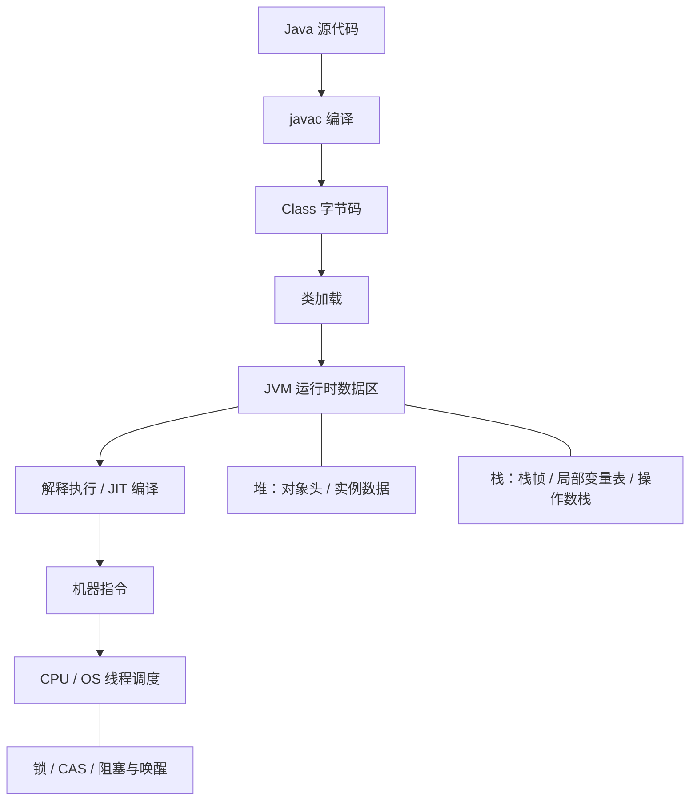
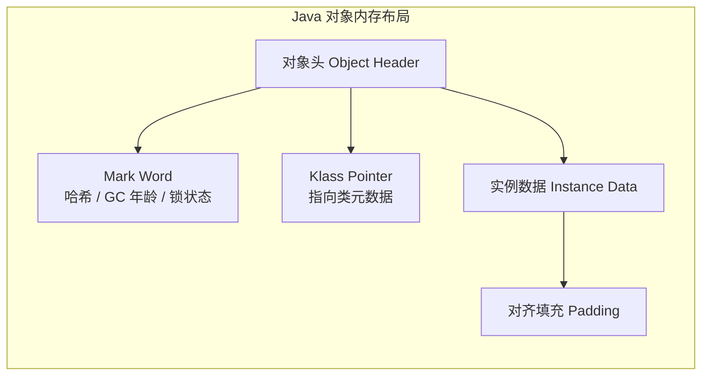
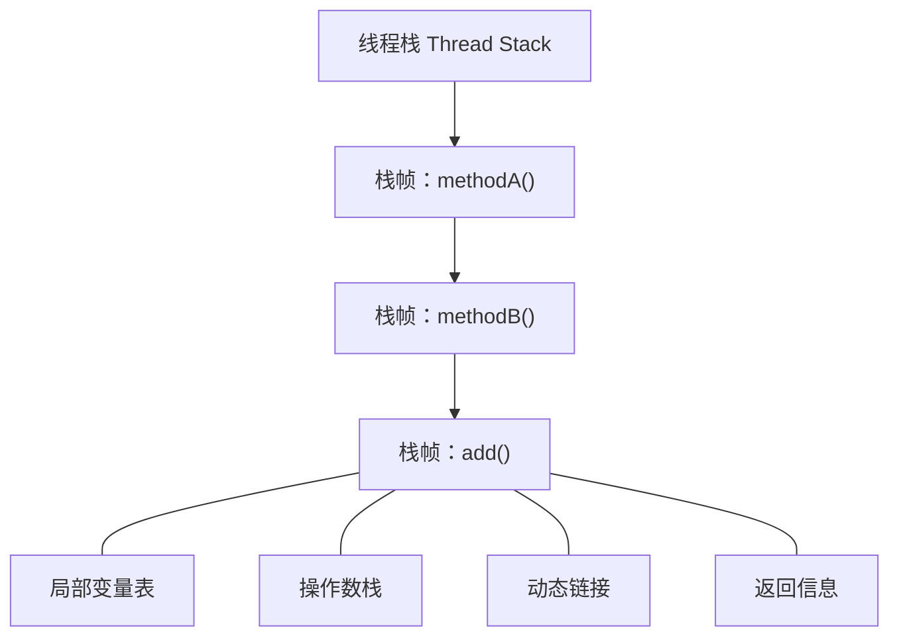
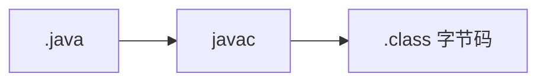
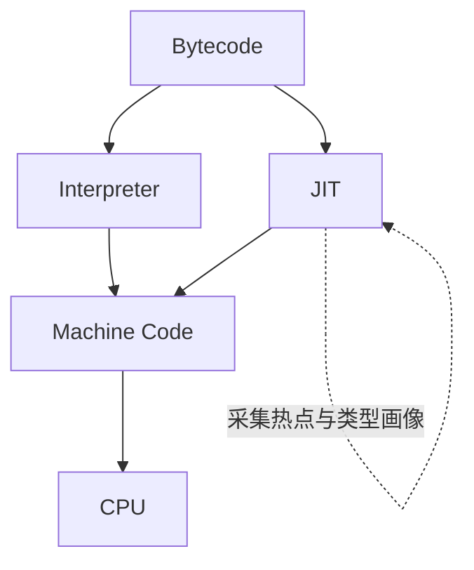
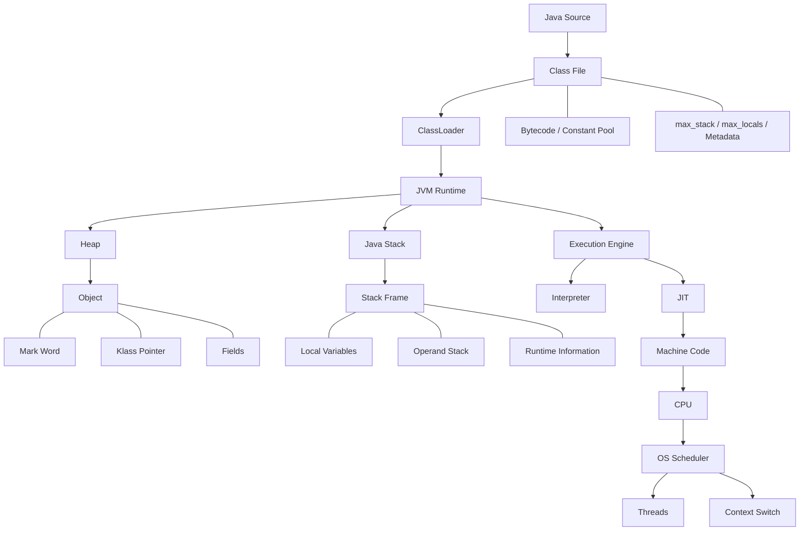
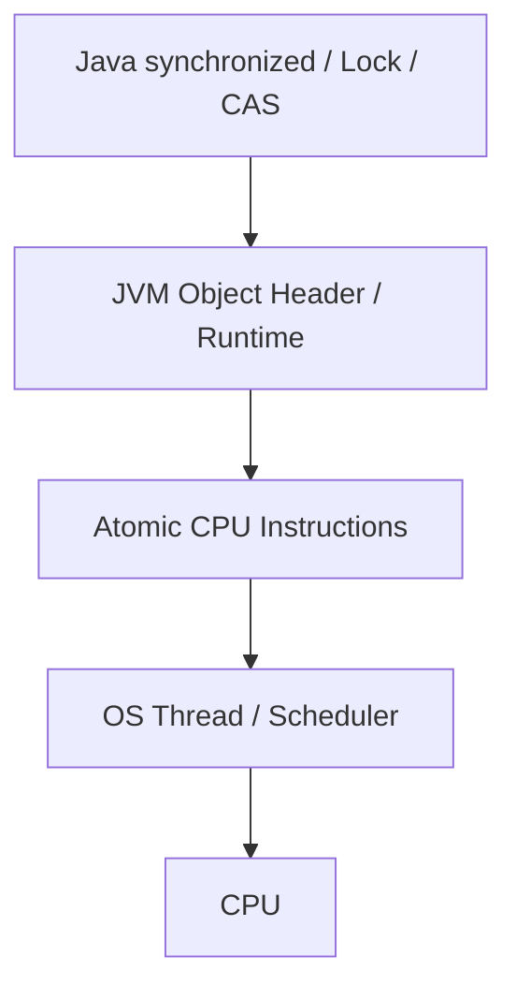

最近重新阅读《深入理解 Java 虚拟机》，我发现一件事：

**JVM 的很多知识，如果孤立记忆，其实非常容易忘。**

对象头、栈帧、`synchronized`、CAS、Spring 参数绑定、线程调度、JIT……表面上分属不同领域，往下挖却常常落在同一条链路上：从一行 Java 代码，一路走到字节码、运行时数据区、机器指令，再到 CPU 与操作系统调度。

这篇文章按我自己的理解路径来写，目标不是堆术语，而是把这条链路立起来。

## 阅读地图

全文大致分五段，可按兴趣跳读：

| 阶段 | 核心问题 | 对应章节 |
| --- | --- | --- |
| 对象与内存布局 | 一个对象在 JVM 里到底长什么样？ | [一](#一一个-java-对象到底是什么) · [二](#二为什么有时候对象头说-32-位有时候又说-64-位) |
| 栈帧与字节码 | 方法执行时，数据放哪里？编译期能确定什么？ | [三](#三对象在堆里方法执行在哪里) · [四](#四局部变量表到底干什么) · [五](#五为什么栈帧大小在编译时期就能知道) · [六](#六java-class-文件里到底有没有参数名) |
| 从字节码到框架 | Spring 如何“知道”该往哪个字段塞值？ | [七](#七那-spring-为什么知道-json-应该放到哪个字段) · [八](#八为什么一个方法不能随便写两个-requestbody) · [九](#九query-string-又在哪里) |
| 锁、CAS 与调度 | 有锁一定切换上下文吗？无锁一定更快吗？ | [十](#十从对象头继续往下synchronized-到底发生了什么) ~ [十六](#十六协程为什么能够改善这个问题) |
| JIT 与全景 | 热点代码如何被改写成更接近硬件的形态？ | [十七](#十七jit-才是-jvm-性能故事里非常精彩的一部分) ~ [二十一](#二十一目前我脑海里的-jvm-全景图) |

## 按问题跳转

如果你是带着具体问题来的，可以直接点进去：

- [对象头为什么会有 32 位、64 位的区别？](#二为什么有时候对象头说-32-位有时候又说-64-位)
- [Mark Word 为什么能用来实现 synchronized？](#一一个-java-对象到底是什么) / [锁升级发生了什么？](#十从对象头继续往下synchronized-到底发生了什么)
- [栈帧到底是什么？](#三对象在堆里方法执行在哪里)
- [为什么局部变量表和操作数栈大小在编译期就能确定？](#五为什么栈帧大小在编译时期就能知道)
- [Java 编译之后还保不保留参数名？](#六java-class-文件里到底有没有参数名)
- [Spring 为什么能把 JSON 自动转换成 Java 对象？](#七那-spring-为什么知道-json-应该放到哪个字段)
- [CAS 为什么能减少上下文切换？](#十一cas-为什么经常和减少上下文切换一起出现)
- [有锁一定意味着线程上下文切换吗？](#十二有锁为什么不一定产生上下文切换)
- [JIT 又是怎么优化这些代码的？](#十七jit-才是-jvm-性能故事里非常精彩的一部分)

## 总览：一条执行链路



理解 JVM，真正重要的不是记住几十个术语，而是把这条链路建立起来。

## Table of contents

## 一、一个 Java 对象到底是什么？

> **本节看什么：** 先把 `new User()` 还原成对象头、实例数据和对齐填充，后面的锁状态、对象大小讨论都建立在这个模型上。

我们平时写：

```java
User user = new User();
```

从业务代码来看，不过是创建了一个 `User`。

但站在 JVM 的视角，这个对象通常可以理解为由几部分组成：



也就是：

**对象头 + 实例数据 + 对齐填充。**

其中最值得关注的是对象头。

### 1. Mark Word

Mark Word 并不负责保存我们的业务字段，而是 JVM 用来保存对象运行时状态的一块空间。

经典 HotSpot 实现中，其中可能编码：

```text
HashCode
GC Age
锁相关状态
其他运行时标记
```

这也是为什么学习 `synchronized` 时，我们又会重新遇到 Mark Word。

换句话说：

> synchronized 并不是一个脱离 JVM 对象模型独立存在的东西。

锁状态和对象本身的运行时元数据存在非常紧密的联系。

这也是 JVM 学习中第一次让我感觉：

**对象内存布局和并发编程其实是连在一起的。**

---

## 二、为什么有时候对象头说 32 位，有时候又说 64 位？

> **本节看什么：** 对象头宽度与压缩指针（Compressed Oops）有关；“64 位 JVM”并不等于对象里每个引用都占 8 字节。

这里的 32 位和 64 位，本质上首先是在讨论 JVM / CPU 的字长以及指针宽度。

在 64 位 JVM 下，如果所有引用都直接使用完整的 64 位地址，那么指针本身的内存开销就会明显增加。

因此 HotSpot 长期存在类似：

```text
Compressed Oops
Compressed Class Pointers
```

这样的压缩指针技术。

简单理解就是：

本来一个地址可能需要：

```text
8 Bytes
```

通过一定的编码方式，可以使用更小的数据表示它。

这也是为什么：

> “64 位 JVM”并不意味着 Java 对象里面所有引用一定都占 8 字节。

分析一个 Java 对象到底占多少内存时，不能只看字段。

还需要考虑：

```text
对象头
+
字段
+
引用大小
+
字段布局
+
对象对齐
```

所以一个：

```java
class User {
    int age;
}
```

绝不是简单的：

```text
4 Bytes
```

这就是 Java 对象为什么经常比刚接触 JVM 时想象得“胖”得多。

---

## 三、对象在堆里，方法执行在哪里？

> **阶段切换：** 对象落在堆里；真正“跑起来”的方法调用，则依赖每个线程自己的 Java 栈，以及一次调用对应的**栈帧**。

对象的问题继续往下，就会遇到另一个非常重要的概念：

**栈帧。**

假设：

```java
public int add(int a, int b) {
    int c = a + b;
    return c;
}
```

线程调用 `add()` 时，JVM 会为这次方法调用建立一个栈帧。

可以粗略理解成：



一个栈帧代表的不是“一个方法”。

更准确地说，是：

> **某个线程对某个方法的一次调用所需要的运行时数据。**

同一个递归方法调用十次，就可能存在十个栈帧。

---

## 四、局部变量表到底干什么？

局部变量表负责存储方法执行期间需要的局部数据。

例如：

```java
public int add(int a, int b) {
    int c = a + b;
    return c;
}
```

其中：

```text
a
b
c
```

对应的数据都会占用局部变量表中的 Slot。

对于实例方法，还有一个非常重要的东西：

```text
this
```

所以可以粗略理解：

```text
slot 0 -> this
slot 1 -> a
slot 2 -> b
slot 3 -> c
```

这里有一个我之前比较容易产生的误区：

> 局部变量表保存的是“变量值所需要的槽位”，并不意味着 JVM 执行方法必须知道变量叫 `a`、`b`、`c`。

机器真正执行代码的时候，并不关心这个变量在源码里面叫什么。

---

## 五、为什么栈帧大小在编译时期就能知道？

《深入理解 Java 虚拟机》里有一句非常重要的话：

> 局部变量表需要多大，操作数栈需要多深，在编译 Java 源代码的时候就已经能够确定。

第一次看到这里可能会觉得奇怪：

程序都还没运行，怎么知道？

原因是 Java 字节码本身具有非常明确的执行结构。

例如：

```java
int c = a + b;
```

编译成字节码之后，大致会经历：

```text
load a
load b
add
store c
```

编译器可以静态分析：

这个方法：

- 最多使用多少个局部变量槽位；
- 操作数栈最深的时候需要多少层。

于是这些信息会被写入 Class 文件中方法的 `Code` 属性。

里面有两个非常重要的信息：

```text
max_stack
max_locals
```

可以简单理解为：

```text
max_stack  = 最大操作数栈深度
max_locals = 最大局部变量槽位数量
```

这让我重新理解了一个概念：

> JVM 并不是运行到一个方法的时候，才开始临时猜这个方法需要多少空间。

大量结构性信息，其实在 javac 阶段已经产生了。

---

## 六、Java Class 文件里到底有没有参数名？

这又引出了另一个很实际的问题：

假设：

```java
public void getUser(String username)
```

运行时 JVM 知不知道这个参数叫 `username`？

答案是：

**不一定。**

参数名称并不是执行 Java 字节码所必需的信息。

从 JVM 执行角度，它只需要知道：

```text
slot 1 中有一个 String
```

至于源码中它叫：

```text
username
```

还是：

```text
name
```

对 CPU 执行代码没有区别。

如果希望通过 Java Reflection 稳定获得参数名称，一种常见方式是在编译时增加：

```text
-parameters
```

Maven 中可以通过 `maven-compiler-plugin` 等方式配置。

它会让 Class 文件保存对应的 `MethodParameters` 信息。

这个问题让我意识到：

> Java 源代码中的很多“语义信息”，编译成 Class 以后并不一定全部存在。

源码世界和 JVM 世界之间，并不是一一对应的。

---

## 七、那 Spring 为什么知道 JSON 应该放到哪个字段？

> **阶段切换：** 编译期丢掉的名字信息，到了框架层又会通过字节码属性、反射、注解和约定重新拼起来。下面三节把“参数名 / Body / Query”拆开看。

比如：

```java
@PostMapping("/user")
public void create(@RequestBody UserDTO user) {
}
```

请求：

```json
{
  "name": "xiaoyu",
  "age": 30
}
```

这里其实存在两个不同问题。

第一个问题：

```text
Spring 怎么知道方法的这个参数要从 Body 获取？
```

因为存在：

```java
@RequestBody
```

Spring MVC 的参数解析机制会选择对应的 `HandlerMethodArgumentResolver` / `HttpMessageConverter` 处理请求体。

第二个问题：

```text
JSON 中的 name 怎么对应 UserDTO.name？
```

这就不是 JVM 方法参数名称解决的了。

通常是 Jackson 根据：

```text
JSON Property
     ↓
Java Bean Property / Field
```

完成反序列化。

所以：

```text
@RequestBody
```

和：

```text
-parameters
```

其实解决的是两类问题。

---

## 八、为什么一个方法不能随便写两个 @RequestBody？

例如：

```java
public void test(
    @RequestBody User user,
    @RequestBody Order order) {
}
```

默认 Spring MVC 并不支持我们这样消费两个独立 Body。

理解这件事情不用背 Spring 规则，只需要回到 HTTP：

```text
HTTP Request
│
├── Request Line
├── Headers
└── Body
```

一次 HTTP 请求本质上只有一份请求 Body。

例如：

```json
{
    "user": {},
    "order": {}
}
```

更合理的做法通常是创建一个：

```java
class RequestDTO {

    private User user;

    private Order order;
}
```

然后：

```java
@RequestBody RequestDTO request
```

因为 Body 本质上是一份输入数据流。

Spring 不能理所当然地假设：

```text
前半段给 User
后半段给 Order
```

应该怎么切。

---

## 九、Query String 又在哪里？

比如：

```text
GET /users?id=100&name=xiaoyu
```

其中：

```text
id=100&name=xiaoyu
```

属于 URL 的 Query String。

它不是 HTTP Body。

从 HTTP 协议结构来看：

```text
GET /users?id=100&name=xiaoyu HTTP/1.1
Host: example.com
...
```

Query String 位于 Request Target 中。

而：

```text
TCP
```

是另外一个层次。

HTTP 看到的是逻辑请求，而 TCP 负责字节流传输。

一次 HTTP 请求到底被 TCP 分成几个 Segment：

```text
HTTP 并不关心。
```

所以：

> HTTP Body 是一个逻辑概念，而 TCP 分包是传输层概念。

这也是学习 JVM 后越来越明显的一点：

很多问题混乱，是因为把不同层次的概念放在一起讨论了。

---

## 十、从对象头继续往下：synchronized 到底发生了什么？

> **阶段切换：** 对象头里的 Mark Word，开始和并发机制正面相遇。后面几节会沿着“有没有竞争 → 要不要进内核 → 会不会上下文切换”往下拆。

讨论完对象，就绕不开锁。

经典 HotSpot 锁实现模型中，我们经常看到：Mark Word、Lock Record、CAS、Monitor。

例如线程尝试获得一个轻量级锁时，可以把逻辑粗略理解为：


线程尝试通过 CAS 修改对象对应的锁状态。

如果没有竞争：


整个过程未必需要让线程进入操作系统阻塞状态。

这就是为什么：

> “使用 synchronized”不等于“发生线程上下文切换”。

这是我之前学习并发时一个非常重要的认知变化。

---

## 十一、CAS 为什么经常和“减少上下文切换”一起出现？

> **本节看什么：** CAS 把一部分“阻塞等待”变成“用户态重试”。它能减少切换，但激烈竞争时也可能把成本转成 CPU 空转。

假设线程 A 和 B 同时修改一个值。

传统阻塞式竞争可能出现：

```text
A 获取锁
B 获取失败
B park / blocking
OS Scheduler
A 执行完成
唤醒 B
B 再运行
```

这里可能涉及线程调度以及上下文切换。

CAS 的思路不同。

例如：

```text
read oldValue

newValue = oldValue + 1

CAS(oldValue, newValue)
```

失败之后：

```text
重新读取
重新计算
再次 CAS
```

也就是说，竞争线程可能仍然保持 runnable/running 状态，通过自旋继续尝试。

因此：

```text
CAS
→ 可能避免阻塞
→ 可能减少调度
→ 可能减少上下文切换
```

但这里一定要加上“可能”。

因为 CAS 并不是免费的。

竞争很严重的时候：

```text
CAS
CAS失败
CAS
CAS失败
CAS
CAS失败
...
```

CPU 就会一直做无效工作。

所以：

> 无锁不是没有成本，而是把“阻塞和调度成本”部分转换成了“CPU 重试成本”。

---

## 十二、有锁为什么不一定产生上下文切换？

这是理解 Java 并发特别重要的一点。

可以把锁竞争分成几种情况。

### 情况一：没有竞争

```text
Thread A
↓
lock
↓
执行
↓
unlock
```

没有其他线程竞争。

当然不需要上下文切换。

---

### 情况二：竞争时间很短

线程 B 获取失败之后，可以短暂自旋：

```text
while (!CAS()) {
}
```

如果 A 很快释放：

```text
B CAS 成功
```

B 甚至不需要进入阻塞状态。

---

### 情况三：竞争时间很长

如果一直自旋：

```text
CPU 就浪费掉了。
```

于是 JVM / 锁实现可能最终让线程：

```text
park
```

线程不能继续执行后，操作系统调度其他线程运行。

这个过程中就可能发生线程上下文切换。

所以真正的关系应该是：

```text
有锁
  ↓
发生竞争
  ↓
竞争无法通过短时间方式解决
  ↓
线程阻塞/park
  ↓
OS重新调度
  ↓
上下文切换
```

而不是：

```text
lock == context switch
```

---

## 十三、阻塞、挂起、调度、上下文切换到底是什么关系？

这是非常容易混淆的一组概念。

我后来倾向于按照“不同层次”去理解。

```text
Java / Application
        │
        │ park / I/O / lock
        ▼
Operating System Kernel
        │
        ├── Thread State
        ├── Scheduler
        └── Context Switch
                │
                ▼
               CPU
```

### 阻塞

阻塞描述的是：

> 线程因为某个条件无法继续执行。

例如：

```text
等待锁
等待网络IO
Object.wait()
LockSupport.park()
```

---

### 调度

CPU 核心是有限的。

假设：

```text
100 Threads
8 CPU Cores
```

不可能 100 个线程真正同时执行。

操作系统 Scheduler 必须不断决定：

```text
接下来让哪个线程占用 CPU？
```

这就是线程调度。

---

### 上下文切换

假设 CPU 原来运行线程 A：

```text
CPU
↓
Thread A
```

现在要执行 B。

CPU 就需要：

```text
保存 A 的执行上下文
↓
恢复 B 的执行上下文
↓
执行 B
```

需要保存的内容可能涉及：

```text
Program Counter
Registers
Stack Pointer
...
```

这就是上下文切换。

因此，上下文切换是有成本的。

---

## 十四、用户态 / 内核态切换又不是上下文切换

这两个概念也很容易混。

应用程序通常运行在：

```text
User Mode
```

需要操作系统服务时，比如：

```text
网络 IO
文件 IO
线程 park
某些系统调用
```

可能进入：

```text
Kernel Mode
```

于是产生：

```text
User Mode
↓
Kernel Mode
↓
User Mode
```

但：

> 用户态/内核态切换和线程上下文切换不是同一个东西。

有可能：

```text
线程还是线程 A
```

只是 A 从用户态进入内核态执行系统调用，然后再返回。

而上下文切换意味着：

```text
Thread A
↓
Thread B
```

这两个概念必须分开。

---

## 十五、为什么减少线程数量也能减少上下文切换？

这就很好理解了。

假设：

```text
8 CPU Cores
```

却创建：

```text
1000 Threads
```

只要大量线程都是 runnable：

```text
T1
↓
T2
↓
T3
↓
T4
...
```

Scheduler 就要不断调度。

线程数量远远超过 CPU 可并行能力之后，更多线程并不会自动带来更高吞吐。

反而可能造成：

```text
更多上下文切换
+
更多线程栈内存
+
更多调度开销
+
更差的 CPU Cache Locality
```

所以并发编程真正要追求的不是：

> “线程越多越快”。

而应该是：

> 用合理数量的执行单元，让 CPU 尽量做真正有价值的工作。

---

## 十六、协程为什么能够改善这个问题？

传统 Java Platform Thread 通常对应操作系统线程。

如果业务存在大量：

```text
等待数据库
等待 Redis
等待 HTTP
等待文件
```

那么大量线程的大部分时间实际上都没有真正执行计算。

协程、虚拟线程等技术尝试解决的核心问题之一，就是：

> 不要让大量“等待中的业务任务”长期占用昂贵的 OS Thread。

从抽象层次来看：

```text
大量业务任务
        ↓
较少/受控的底层执行资源
        ↓
CPU
```

因此它们解决的不是：

```text
让 CPU 无限并行
```

而更多是：

```text
降低并发任务管理成本
提高阻塞型场景的资源利用率
```

---

## 十七、JIT 才是 JVM 性能故事里非常精彩的一部分

> **阶段切换：** 前面讨论的是“数据结构与调度”，这里开始看执行引擎如何利用运行时画像，把热点字节码变成更接近硬件的机器码。

Java 最开始：



生成的并不是最终 CPU 机器码。真正运行时：



JIT，也就是 Just-In-Time Compiler。

它最重要的思想不是简单地：

> “把 Java 编译成机器码”。

而是：

> **利用程序真实运行过程中采集到的信息，对热点代码做优化。**

例如：

```text
一个方法调用 3 次
```

和：

```text
一个方法调用 3 亿次
```

优化价值显然完全不同。

JVM 可以不断收集：

```text
方法调用次数
循环执行次数
对象类型分布
调用关系
分支概率
```

然后找到 Hot Spot。

这也是 HotSpot JVM 名字背后的核心思想之一。

---

## 十八、JIT 能做哪些让人惊讶的优化？

例如：

```java
int result = add(a, b);
```

其中：

```java
int add(int a, int b) {
    return a + b;
}
```

普通理解是：

```text
调用 add
建立调用关系
执行
返回
```

JIT 发现这个方法很小、调用非常频繁以后，可能直接做：

```text
Method Inlining
```

最终逻辑接近：

```java
int result = a + b;
```

方法调用本身都可能消失。

---

另外还有一个非常重要的优化：

```text
Escape Analysis
```

例如：

```java
User user = new User();
user.age = 18;
return user.age;
```

如果 JIT 能证明这个对象不会逃逸出当前方法或者线程，就有机会进一步做：

```text
Scalar Replacement
Lock Elimination
```

最终甚至可能出现一种非常反直觉的情况：

> 源代码里明明写了 `new User()`，最终机器代码执行的时候，却未必真的存在我们想象中的完整 User 对象分配过程。

这也是 JVM 最有意思的地方。

我们写的是：

```text
Java Source Code
```

JVM 真正执行的是：

```text
经过大量运行时优化之后的 Machine Code
```

两者并不总是一一对应。

---

## 十九、JIT 也让我重新理解 synchronized

假设：

```java
synchronized (obj) {
    // code
}
```

源码明确出现了锁。

但如果 JIT 经过逃逸分析以后发现：

```text
obj 绝对不可能被其他线程访问
```

那么这个锁其实没有任何意义。

于是理论上可以：

```text
Lock Elimination
```

这再次说明：

> “Java 源代码里有什么”不等于“CPU 最终一定执行什么”。

所以分析 Java 性能的时候，如果只停留在源码层面，很容易产生误判。

---

## 二十、我现在理解 JVM 的方式发生了变化

以前学习 JVM，很容易变成这样：

```text
背 JVM 内存结构
背对象头
背 GC
背锁升级
背 JIT
```

但现在我越来越觉得，更好的方式应该是不断问：

```text
为什么？
```

比如：

#### 为什么 Java 需要栈帧？

因为方法调用需要独立的运行时上下文。

#### 为什么需要局部变量表？

因为方法执行需要存放参数和中间局部数据。

#### 为什么需要操作数栈？

因为 JVM 字节码是一种基于栈的指令集架构。

#### 为什么对象头和 synchronized 有关系？

因为 JVM 需要在对象运行时元数据中表达锁相关状态。

#### 为什么 CAS 可以减少上下文切换？

因为短暂竞争有机会在用户代码继续运行的过程中解决，而不是立即阻塞线程交给 Scheduler。

#### 为什么 CAS 也可能性能很差？

因为激烈竞争时大量线程会不断消耗 CPU 重试。

#### 为什么 JIT 很重要？

因为 JVM 可以根据程序真实运行情况生成比静态编译阶段更有针对性的机器代码。

当这些问题连接起来之后，JVM 就不再是几十个互不相关的面试题。

它开始变成一套完整的计算机系统。

---

## 二十一、目前我脑海里的 JVM 全景图

到目前为止，我会把整个 Java 程序的运行过程理解成：



而并发机制又横跨整个体系：



这大概也是我这一阶段阅读《深入理解 Java 虚拟机》最大的收获：

**真正理解 JVM，并不是知道 JVM 本身有多少组件，而是理解 Java 代码最终是怎样一路变成 CPU 指令并执行起来的。**

很多原本分散的知识：

```text
对象
栈帧
字节码
反射
Spring
锁
CAS
线程
操作系统调度
JIT
```

最终其实都可以汇聚到同一个问题：

> **我写下这一行 Java 代码之后，计算机到底发生了什么？**

当这个问题可以一路从 Java 源代码回答到 JVM、操作系统乃至 CPU 时，JVM 才算真正开始学进去了。