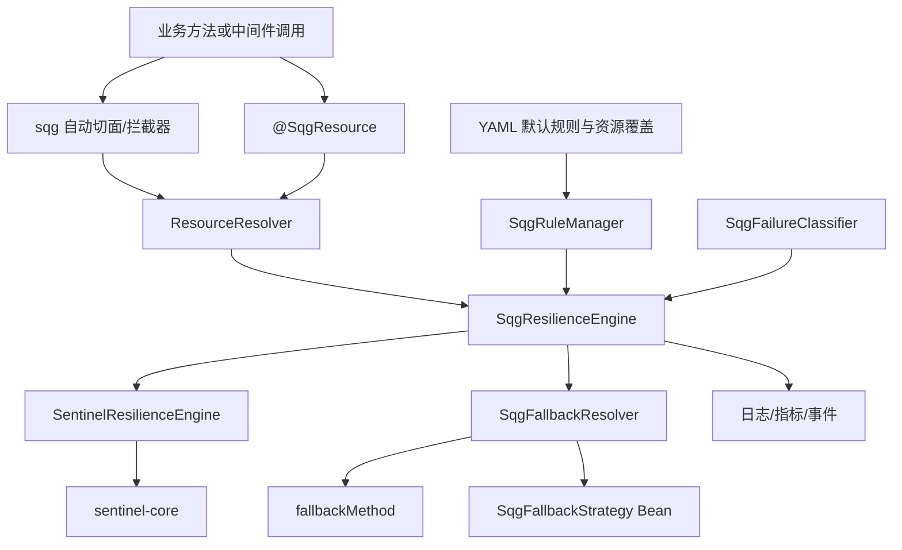
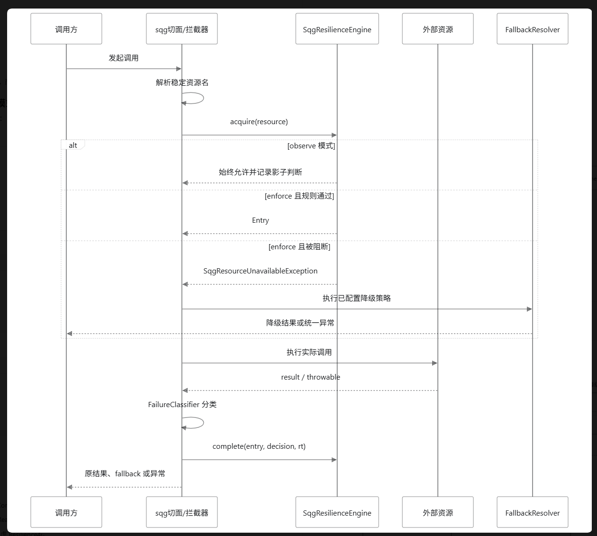

> 状态：方案草案  
> 
> 更新日期：2026\-08\-14  
> 
> 能力载体：`one-logger` 基础框架  
> 
> 适用对象：所有接入 `one-logger` 的 Spring Boot 业务服务
> 
> 


## 1\. 背景


`one-logger` 当前定位是业务服务的基础框架，通过切面、拦截器和中间件扩展点，对 Redis、MySQL、HTTP、Dubbo、Kafka、RabbitMQ、Elasticsearch 等调用进行统一日志记录。


本方案不是为 `one-logger` 自身增加业务层面的熔断或降级，而是把它建设成服务韧性能力的统一承载框架：任何接入 `one-logger` 的业务服务，都可以低成本获得针对自身入口流量和外部依赖调用的保护能力。


职责边界如下：


|层次|对象|职责|
|---|---|---|
|被治理主体|接入 sqg\-env\-config 的业务服务|承载业务请求，调用 Redis、MySQL、HTTP、RPC、MQ 等资源|
|能力承载层|sqg\-env\-config|自动识别资源、接入调用边界、提供注解/config/fallback/异常分类和统一可观测性|
|规则执行层|Sentinel Core|完成统计、限流判断、熔断状态机、半开探测和系统保护|
|业务扩展层|具体业务应用|仅在需要业务语义时声明资源名称、覆盖规则或提供 fallback 策略|


因此，文档中所称的“服务保护”“入口保护”“外部资源保护”，其保护对象始终是接入框架的业务服务；`one-logger` 是实现和分发这些能力的基础设施。


现阶段 `one-logger` 已能为业务服务提供中间件可观测能力，但还不能为这些业务服务提供以下保障：


- 外部依赖异常或变慢时快速失败，防止线程和连接池持续堆积。

- 流量突增时限制入口或资源并发，保护应用自身。

- 服务过载时根据 CPU、并发和吞吐等指标进行自适应降载。

- 资源被限流或熔断后，按业务指定的策略进行 fallback。

- 用尽可能少的业务配置自动覆盖已有中间件调用。

- 先观测、后执行，降低基础框架直接上线熔断规则的风险。

    

本方案参考 go\-zero 的“稳定性能力默认内建”思路，但不直接照搬其 Go 代码；Java 侧优先采用 Sentinel Core 作为可靠的规则执行与状态管理内核，由 sqg\-env\-config 将这些能力透明地提供给接入它的业务服务。


## 2\. 建设目标


### 2\.1 目标


1. 接入 sqg\-env\-config 的业务服务，其已被框架拦截的中间件原则上无需额外编码即可获得指标采集和可选保护。

2. 业务自定义外部资源只需增加一个 sqg 注解，并在需要时指定 fallback。

3. 默认采用安全的 `observe` 模式，不直接拒绝线上请求。

4. 保护规则提供内置默认值，并允许通过 YAML 按资源覆盖。

5. Sentinel 只作为内部引擎，不向业务暴露 Sentinel 注解和异常。

6. 为未来接入 Nacos、Dashboard 或替换其他引擎保留扩展点。

7. 支持同步、`CompletableFuture` 以及常用异步中间件的正确生命周期统计。

8. 同一套基础框架能力可在不同业务服务中复用，但每个服务实例独立统计、独立熔断并支持独立规则覆盖。

    

### 2\.2 非目标


第一阶段暂不包括：


- 默认开启自动重试。

- 默认给所有资源设置固定 QPS 阈值。

- 引入完整 Sentinel Dashboard、Transport 和集群限流体系。

- 自动生成有业务语义的降级数据。

- 以保护 sqg\-env\-config 自身内部逻辑为主要建设目标。

- 完全复制 go\-zero 的所有负载均衡、限流和 RPC 治理能力。

- 将 SQL、Redis key、用户 ID 等高基数信息作为资源名称。

    

## 3\. 概念边界


服务韧性需要区分以下能力，避免统一称为“限流”后产生错误设计。


|能力|保护对象|触发信号|典型结果|
|---|---|---|---|
|熔断 Circuit Breaker|不健康的外部依赖|异常比例、异常数、慢调用比例|暂停调用并快速失败|
|限流 Rate Limit|指定资源的调用速率|QPS 或固定配额|拒绝或匀速排队|
|并发隔离 Bulkhead|线程、连接和资源池|同时执行数量|超限快速失败|
|自适应降载 Load Shedding|当前应用实例|CPU、load、RT、吞吐、入口并发|拒绝部分入口流量|
|超时 Timeout|单次调用|调用持续时间|中止等待并返回超时|
|降级 Fallback|被阻断或失败的调用|熔断、限流、超时或业务指定异常|缓存、默认值、排队或友好错误|
|重试 Retry|短暂性故障|可重试错误|再次调用，可能放大流量|


下游熔断解决“不要继续调用已经不健康的依赖”，入口降载解决“不要让当前应用自身被压垮”，二者不能互相替代。


## 4\. go\-zero 实现调研结论


### 4\.1 下游自适应熔断


go\-zero 的 breaker 基于 Google SRE 客户端自适应节流思想。当前代码的主要特征是：


- 10 秒滑动窗口。

- 40 个 bucket，每个 bucket 250ms。

- 基础系数 `K=1.5`，根据连续失败 bucket 动态下降至 `1.1`。

- 低样本保护值为 5。

- 根据历史请求总数与成功数计算拒绝概率。

- 不是严格的全开/全关，而是概率式逐渐拒绝和逐渐恢复。

- 长时间没有请求通过时，允许周期性探测请求。

- 支持 acceptable error，避免业务错误被统计为依赖故障。

    

核心拒绝概率可以抽象为：


```Plain Text
dynamicK = f(连续失败 bucket 数量)

dropRatio =
    (total - protection - dynamicK * accepts)
    / (total + 1)
```


算法代码本身规模不大，但它依赖线程安全滑动窗口、时间处理、随机概率、上下文取消识别、指标记录以及各组件的异常分类。


### 4\.2 入口自适应降载


go\-zero 的 load shedder 是独立于 breaker 的另一套实现，主要根据以下条件决定是否丢弃新请求：


- CPU 是否达到阈值。

- 当前请求是否仍处于过载冷却期。

- 历史最大通过量 `maxPass`。

- 历史最小响应时间 `minRT`。

- 当前执行中请求数和移动平均执行中请求数。

    

其容量估算思想可简化为：


```Plain Text
maxFlight ≈ maxQPS × minRT
```


只有系统过载并且当前并发超过估算容量时才降载，避免仅凭 CPU 瞬时尖峰直接拒绝流量。


### 4\.3 go\-zero 自动应用范围


go\-zero 的 breaker 已集成到 zRPC、HTTP 客户端/服务端、Redis、sqlx/MySQL、Mongo 等组件。但“自动集成”并不等于所有调用路径都必然经过熔断器：raw client、自定义连接、事务内部调用或绕开框架封装的 API 仍可能绕过保护。


### 4\.4 是否建议直接重写


只实现 breaker 算法原型并不重；将其建设成基础框架生产能力较重。


|范围|粗略成本|说明|
|---|---|---|
|Java breaker 原型|3～5 人日|证明公式可运行|
|生产级 breaker 内核|10～20 人日|并发窗口、时间、恢复、事件和测试|
|再实现自适应 load shedder|增加 10～20 人日|JVM/容器指标和容量校准风险更高|
|通过 sqg\-env\-config 完整赋能业务服务|总计 40～70 人日|包含全部中间件、fallback、配置、可观测和灰度|


手写方案的长期风险主要来自算法外围，而不是拒绝概率公式本身。


## 5\. Java 方案对比


### 5\.1 Sentinel


Sentinel 的定位是以 Resource 为中心的流量治理和服务保护引擎，核心能力包括：


- QPS 和并发线程数流控。

- 直接拒绝、预热、匀速排队。

- 异常比例、异常数和慢调用比例熔断。

- `CLOSED / OPEN / HALF_OPEN` 状态管理。

- JVM 系统自适应保护。

- 调用来源、调用链和关联资源规则。

- 规则动态加载 API、状态事件和运行指标。

- 可选的 Dashboard、动态数据源、热点参数和集群流控模块。

    

注意事项：


- Sentinel 不会仅因为加入依赖就自动保护 Redis/MySQL。

- `sentinel-datasource-redis` 表示从 Redis 加载规则，并非保护 Redis 调用。

- 系统自适应规则只对 `EntryType.IN` 入口资源生效。

- Sentinel 不会自动判断业务异常和依赖异常。

- Sentinel 的状态机式熔断不等同于 go\-zero 的概率式自适应 breaker。

- 只引入 `sentinel-core` 时，不包含 Dashboard、Transport、Nacos 数据源和 Spring 注解切面。

    

### 5\.2 Resilience4j


Resilience4j 的定位是轻量级、可组合的容错策略库，优势包括：


- CircuitBreaker。

- Retry。

- RateLimiter。

- Semaphore Bulkhead 和 ThreadPool Bulkhead。

- TimeLimiter。

- 函数装饰器和 Spring 注解。

- Registry、事件、Micrometer 和 Actuator 集成。

- 多种策略可以按明确顺序组合。

    

其不足是：


- 没有 Sentinel 对应的 JVM 入口系统自适应保护。

- 没有调用链、热点参数和集群总量限流等一体化治理能力。

- 没有对应的官方集中治理控制台。

- 更适合业务显式声明保护策略，而不是由基础框架自动把所有中间件转成统一 Resource。

- Resilience4j 2\.x 要求 Java 17；sqg\-env\-config 当前 Java 8 基线需要停留在较旧的 1\.7\.1 分支，增加长期维护风险。

    

### 5\.3 综合对比


|维度|自研 go\-zero 风格|Sentinel Core|Resilience4j|
|---|---|---|---|
|核心定位|自适应熔断/降载算法|资源级流量治理引擎|应用内容错策略库|
|维护状态|由团队自行负责|活跃开源项目|活跃开源项目|
|初期依赖|无第三方治理依赖|仅 sentinel\-core 可很轻|可按模块引入|
|熔断模型|概率式逐步拒绝|明确状态机|明确状态机，配置细致|
|慢调用保护|需要自建|慢调用比例熔断|慢调用比例熔断|
|QPS 流控|需要自建|支持|支持|
|并发隔离|需要自建|并发线程数控制|Semaphore/ThreadPool Bulkhead|
|Retry|需要自建|非核心能力|原生支持|
|Timeout|需要自建|由调用组件负责|原生 TimeLimiter|
|自适应系统保护|可复制 go\-zero|支持入口系统规则|无对应能力|
|调用链/来源规则|需要自建|支持|不突出|
|动态规则体系|需要自建|支持并可扩展数据源|以 Registry/配置为主|
|Dashboard|需要自建|可选|无对应官方治理台|
|Java 8 适配|可自行控制|支持|需使用旧版本|
|Spring 事务兼容|可自行设计|同线程调用，适配相对自然|信号量模式自然，线程池模式需传播上下文|
|自动中间件治理|全部自行建设|sqg 适配后适合|sqg 适配后可实现|
|初期开发成本|高|中|中|
|长期维护风险|高|低|中，受 Java 版本约束|


### 5\.4 方案结论


当前推荐：


```Plain Text
Sentinel Core + one-logger 自有适配层
```


不推荐：


- 业务代码直接使用 `@SentinelResource`。

- 第一阶段引入完整 Spring Cloud Alibaba Sentinel Starter。

- 第一阶段直接复制 go\-zero breaker 和 load shedder。

- 在 Java 8 基线上新增对旧版 Resilience4j 的核心依赖。

    

如果未来升级至 Java 17，并且目标收缩为“显式的熔断、重试、超时、隔离策略组合”，可以重新评估 Resilience4j。


## 6\. 面向业务服务的推荐总体架构




### 6\.1 引擎隔离


业务层和 sqg 自动切面只能依赖 sqg 接口：


```Java
public interface SqgResilienceEngine {
    SqgEntry acquire(SqgResourceContext context);

    void complete(SqgEntry entry, SqgInvocationResult result);

    void updateRules(SqgRuleSnapshot rules);
}
```


第一版实现：


```Plain Text
SentinelResilienceEngine
```


未来可扩展：


```Plain Text
GoogleAdaptiveBreakerEngine
Resilience4jEngine
NoopResilienceEngine
```


这样可以避免 sqg 的注解、异常和配置结构与 Sentinel API 强耦合。


## 7\. 对外 API 设计


### 7\.1 注解


```Java
@Target(ElementType.METHOD)
@Retention(RetentionPolicy.RUNTIME)
public @interface SqgResource {
    String value();

    SqgEntryType entryType() default SqgEntryType.OUT;

    String fallbackMethod() default "";

    Class<? extends SqgFallbackStrategy> fallbackStrategy()
        default NoopSqgFallbackStrategy.class;

    Class<? extends Throwable>[] exceptionsToIgnore() default {};
}
```


使用示例：


```Java
@SqgResource(
    value = "mysql:user:query",
    fallbackMethod = "queryUserFallback",
    exceptionsToIgnore = EmptyResultDataAccessException.class
)
public User queryUser(long id) {
    return userRepository.queryById(id);
}

private User queryUserFallback(long id, Throwable cause) {
    return User.empty(id);
}
```


可复用策略示例：


```Java
@SqgResource(
    value = "http:user-center:query",
    fallbackStrategy = UserCenterFallbackStrategy.class
)
public UserProfile queryProfile(long userId) {
    return userCenterClient.query(userId);
}
```


### 7\.2 fallback 接口


```Java
public interface SqgFallbackStrategy {
    Object fallback(SqgFallbackContext context) throws Throwable;
}
```


`SqgFallbackContext` 至少包含：


- 资源名称。

- 入口/出口类型。

- 被调用方法。

- 调用参数，只允许日志安全使用。

- 原始异常。

- 阻断类型：flow、degrade、system、authority、unknown。

- 当前规则摘要。

- traceId。

    

### 7\.3 统一异常


业务层不直接接触 Sentinel `BlockException`，统一转换为：


```Java
SqgResourceUnavailableException
```


异常至少提供：


- `resourceName`

- `reason`

- `retryable`

- `cause`

    

### 7\.4 fallback 约束


- `fallbackMethod` 与 `fallbackStrategy` 互斥。

- 同时配置时启动失败，而不是运行时随机选择。

- fallback 方法参数必须是原方法参数加最后一个 `Throwable` 或特定异常。

- fallback 返回类型必须兼容原方法返回类型。

- `exceptionsToIgnore` 命中后原样抛出，不计入熔断，也不执行 fallback。

- 自动中间件资源默认只快速失败，不生成不可靠的业务返回值。

- 类型安全的业务降级优先配置在外围 Facade 方法上。

    

## 8\. 配置设计


### 8\.1 全局模式


```YAML
env:
  config:
    resilience:
      enabled: true
      mode: observe # off | observe | enforce
      max-resources: 2000
```


模式语义：


|模式|采集指标|计算规则|实际拒绝|
|---|---|---|---|
|off|否|否|否|
|observe|是|是或影子计算|否|
|enforce|是|是|是|


默认使用 `observe`。


### 8\.2 建议的初始默认配置


以下数值只是第一轮验证基线，不是未经压测即可直接全量执行的生产标准。


```YAML
env:
  config:
    resilience:
      mode: observe
      max-resources: 2000

      defaults:
        circuit-breaker:
          enabled: true
          strategy: exception-ratio
          exception-ratio-threshold: 0.50
          minimum-request-amount: 20
          statistical-window: 10s
          open-duration: 10s
          slow-call-enabled: false

        flow:
          enabled: false

        system:
          enabled: true
          cpu-usage-threshold: 0.90

      resources:
        "http:user-center:query":
          circuit-breaker:
            strategy: slow-request-ratio
            slow-call-duration: 800ms
            slow-call-ratio-threshold: 0.60
            minimum-request-amount: 30
            open-duration: 15s

        "redis:default:read":
          circuit-breaker:
            exception-ratio-threshold: 0.70

        "web:/api/order/create":
          flow:
            enabled: true
            qps: 500
```


### 8\.3 默认规则原则


- 默认允许采集异常比例，但在 `observe` 模式不拦截。

- 慢调用阈值与业务延迟强相关，第一版默认关闭。

- QPS 与并发阈值无法跨应用通用，必须显式配置或通过容量评估生成。

- Retry 默认关闭。

- 系统规则只作用于 IN 资源。

- 规则变更使用完整快照替换，避免部分更新导致状态不一致。

- 配置错误在启动期暴露；动态规则错误保留上一份有效快照。

    

## 9\. 资源模型


### 9\.1 资源粒度


默认采用：


```Plain Text
依赖实例 + 操作分组
```


不能过粗，否则一个操作故障导致整个依赖全部熔断；也不能过细，否则资源数量失控。


### 9\.2 建议资源名称


|中间件|建议名称|EntryType|
|---|---|---|
|Spring MVC|`web:{normalizedRoute}`|IN|
|RestTemplate|`http:{host}:{operation}`|OUT|
|Redis|`redis:{connectionFactory}:read/write/script`|OUT|
|MyBatis|`mysql:{datasource}:query/update`|OUT|
|JdbcTemplate|`jdbc:{datasource}:query/update/batch`|OUT|
|Dubbo Consumer|`dubbo:{interface}:{method}:consumer`|OUT|
|Dubbo Provider|`dubbo:{interface}:{method}:provider`|IN|
|Kafka Producer|`kafka:{cluster}:{topic}:send`|OUT|
|Kafka Consumer|`kafka:{cluster}:{topic}:consume`|IN|
|Rabbit Producer|`rabbit:{connection}:{exchange}:send`|OUT|
|Rabbit Consumer|`rabbit:{connection}:{queue}:consume`|IN|
|Elasticsearch|`elasticsearch:{cluster}:search/write`|OUT|
|Graph|`graph:{cluster}:query/write`|OUT|


### 9\.3 高基数保护


资源名称中禁止包含：


- Redis key。

- 完整 SQL 和 SQL 参数。

- 用户 ID、订单 ID、设备 ID。

- 未归一化 URL。

- MQ message key。

- Elasticsearch 查询条件。

    

超过 `max-resources` 后：


1. 不再创建新资源。

2. 降级到对应中间件的聚合资源。

3. 输出限频告警。

4. 记录资源超限指标。

    

## 10\. 异常分类


统一扩展点：


```Java
public interface SqgFailureClassifier {
    boolean supports(SqgResourceContext context);

    SqgFailureDecision classify(
        SqgResourceContext context,
        Object result,
        Throwable error
    );
}
```


决策类型：


```Plain Text
SUCCESS
FAILURE
IGNORED
SLOW_SUCCESS
SLOW_FAILURE
```


### 10\.1 初始分类原则


|场景|建议分类|
|---|---|
|Redis nil / cache miss|SUCCESS|
|Redis 连接异常、读写超时|FAILURE|
|MySQL empty result|IGNORED 或 SUCCESS|
|MySQL 连接异常、查询超时|FAILURE|
|MySQL 唯一键冲突|默认 IGNORED，允许覆盖|
|MySQL 死锁|FAILURE，可由上层决定有限重试|
|HTTP 2xx/3xx|SUCCESS|
|HTTP 4xx|默认 IGNORED，429 可按依赖约定覆盖|
|HTTP 5xx、连接失败、超时|FAILURE|
|调用方主动取消|默认 IGNORED|
|Kafka/Rabbit broker 不可用|FAILURE|
|MQ 业务反序列化失败|默认 IGNORED 或业务资源失败|
|Sentinel/sqg 主动阻断|不重复计为下游失败|


异常分类应支持以下优先级：


```Plain Text
注解 exceptionsToIgnore
    > 资源级配置
    > 中间件专用分类器
    > 全局默认分类器
```


## 11\. 关键执行流程


### 11\.1 同步调用




### 11\.2 异步调用


异步方法不能在方法返回时立即结束 Entry，必须：


1. 调用前申请异步 Entry。

2. 对 `CompletionStage` 注册完成回调。

3. 在完成回调中分类成功、失败、取消和超时。

4. 在 `finally` 语义下关闭 Entry，且只能关闭一次。

5. 处理 fallback 返回同步值或异步值的类型兼容问题。

    

Kafka/Rabbit 异步发送也应在 broker acknowledgement 或发送 future 完成时记录结果，而不是在调用 `send` 返回时记录成功。


### 11\.3 AOP 与事务顺序


韧性切面应位于事务切面外层：


```Plain Text
SqgResilienceAspect
    → TransactionAspect
        → Repository / MyBatis / JdbcTemplate
    → 事务提交或回滚完成
→ fallback
```


目标是保证数据库异常触发事务回滚后再进入 fallback，避免 fallback 运行在已经标记 rollback\-only 的事务中。


同时需要明确：


- Spring 同类自调用不会经过代理。

- 基础设施自动切面和业务 `@SqgResource` 可能形成嵌套资源。

- 内层 MySQL 资源快速失败后，外层业务资源是否统计失败由分类器决定。

- fallback 不能被当前资源再次递归保护。

    

## 12\. 业务服务的自动接入范围


利用 sqg\-env\-config 已有拦截点，为接入框架的业务服务自动增加保护：


### 第一优先级


- RestTemplate。

- RedisTemplate。

- MyBatis。

- JdbcTemplate。

- Dubbo Consumer/Provider。

- Spring MVC 入口。

    

### 第二优先级


- Kafka Producer/Consumer。

- RabbitMQ Producer/Consumer。

- Elasticsearch。

- Graph。

    

每个适配器必须确认：


- 实际执行边界在哪里。

- 是否存在 raw API 绕过路径。

- 同步和异步完成时机。

- 中间件专用异常分类。

- 资源名称是否稳定。

- 与现有日志切面的执行顺序。

- 是否可以在无 Sentinel 规则时保持接近零业务影响。

    

## 13\. 可观测性


### 13\.1 指标


建议至少提供：


```Plain Text
sqg_resilience_requests_total{resource,result}
sqg_resilience_blocked_total{resource,reason}
sqg_resilience_fallback_total{resource,result}
sqg_resilience_state_transition_total{resource,from,to}
sqg_resilience_request_duration_seconds{resource}
sqg_resilience_resources_current{type}
sqg_resilience_resource_overflow_total{type}
sqg_resilience_shadow_block_total{resource,reason}
```


生产指标需要控制 resource label 基数，并允许关闭明细资源指标、仅保留聚合指标。


### 13\.2 日志


以下事件记录结构化日志：


- 熔断状态变化。

- 规则加载成功或失败。

- observe 模式下本应被拒绝的影子事件。

- 资源数量超限。

- fallback 成功或失败。

- 不合法资源名。

    

不能逐请求打印限流日志，需要按资源和原因限频。


### 13\.3 事件扩展点


```Java
public interface SqgResilienceEventListener {
    void onEvent(SqgResilienceEvent event);
}
```


第一版用于日志和指标，未来可用于告警、审计和 Dashboard 推送。


## 14\. 规则管理


第一阶段规则来源：


```Plain Text
内置默认值
    < application.yml
    < 资源级 YAML 覆盖
```


未来扩展：


```Plain Text
SqgRuleSource SPI
    ├── YamlRuleSource
    ├── NacosRuleSource
    ├── ApolloRuleSource
    └── DashboardRuleSource
```


动态规则必须满足：


- 原子快照替换。

- 版本号和更新时间可查询。

- 无效配置不覆盖上一版本。

- 支持回滚。

- 记录规则来源。

- 相同资源冲突时有固定优先级。

    

## 15\. 手写实现的主要风险


### 15\.1 算法正确性


- 并发滑动窗口计算错误。

- 半开探测风暴。

- 服务抖动导致频繁开关。

- 低流量误熔断。

- 时间回拨或空闲窗口处理错误。

- 概率随机行为难以复现和排查。

    

### 15\.2 误判风险


- 将业务异常当成依赖故障。

- 将缓存未命中当成 Redis 故障。

- 将调用方取消当成下游超时。

- 将主动阻断再次统计为外部失败。

    

### 15\.3 自适应降载风险


- JVM CPU 与容器 CPU quota 的语义不一致。

- load average 在容器和不同操作系统上的含义不同。

- GC、JIT、线程池和连接池会影响容量估算。

- `maxQPS × minRT` 只能估算已有工作负载，无法预测新流量结构。

- 参数不当会在高峰期把正常请求大量拒绝。

    

### 15\.4 框架接入风险


- AOP 与事务顺序错误。

- 异步 Entry 泄漏。

- ThreadLocal 跨线程失效。

- fallback 类型不匹配。

- 自调用导致注解不生效。

- 同一调用被多个切面重复统计。

    

### 15\.5 运维风险


- 缺少命中原因和状态指标。

- 规则无法动态关闭或回滚。

- 资源名高基数造成内存和指标系统压力。

- 默认规则未经观测直接执行。

    

## 16\. 实施阶段


### 阶段 0：基线整理


- ~~统一项目 Java、Spring Boot 和依赖版本基线。~~

- ~~修复或隔离现有 Spotless 构建问题。~~

- 列出每个中间件现有切面、拦截器和真实执行边界。

- 建立资源命名规范和异常分类表。

    

### 阶段 1：核心骨架与 observe


- 引入 `sentinel-core`，不引入 Dashboard 和完整 Starter。

- 建立 `SqgResilienceEngine`、注解、配置和统一异常。

- 实现 `off/observe/enforce`。

- 先接 RestTemplate、Redis、MyBatis/JDBC。

- 建立影子阻断指标，不实际拒绝。

    

### 阶段 2：熔断与 fallback


- 启用资源级异常比例和慢调用规则。

- 支持同类 fallbackMethod。

- 支持可复用 `SqgFallbackStrategy` Bean。

- 校验 AOP、事务、嵌套资源和异常传播。

- 小范围资源从 observe 切换至 enforce。

    

### 阶段 3：入口与异步资源


- 接入 Spring MVC、Dubbo Provider 等 IN 资源。

- 接入 Kafka/RabbitMQ 异步完成流程。

- 在 observe 模式验证系统规则。

- 经过容量压测后选择性执行并发/QPS/系统保护。

    

### 阶段 4：动态治理


- 实现 `SqgRuleSource` SPI。

- 评估 Nacos 规则推送和持久化。

- 评估 Sentinel Dashboard 或自有控制台。

- 根据真实需求评估热点参数和集群限流。

    

### 阶段 5：可选算法扩展


只有在生产数据证明 Sentinel 状态机恢复过于生硬时，再实现：


```Plain Text
GoogleAdaptiveBreakerEngine
```


并仅针对显式配置的资源启用，不替换默认 Sentinel 引擎。


## 17\. 测试与验收


### 17\.1 单元测试


- 最小请求数边界。

- 错误比例和慢调用阈值边界。

- 熔断、半开和恢复。

- exceptionsToIgnore。

- fallback 方法解析和返回类型。

- 动态规则替换失败时保留旧规则。

- 最大资源数和聚合降级。

- fake clock 时间推进。

    

### 17\.2 并发与异步测试


- 高并发资源创建。

- 规则更新与调用同时发生。

- `CompletableFuture` 成功、失败、取消和超时。

- Entry 恰好关闭一次。

- ThreadLocal/trace 上下文正确传播。

- fallback 并发安全。

    

### 17\.3 故障注入


- Redis 连接超时和连接拒绝。

- MySQL 慢查询、连接池耗尽和死锁。

- HTTP 4xx、5xx、超时和断连。

- Dubbo Provider 不可用和超时。

- Kafka/Rabbit broker 不可用。

- CPU 压力、GC 停顿和入口突发流量。

    

### 17\.4 验收条件


- observe 模式不会改变业务返回结果。

- enforce 模式只对配置资源生效。

- 业务异常不会误触发依赖熔断。

- 熔断时外部调用数量显著下降。

- 资源恢复后能够自动恢复调用。

- fallback 执行前数据库事务已经正确回滚。

- 异步调用没有 Entry 和上下文泄漏。

- 所有阻断都能从指标或日志解释原因。

- 规则错误能够安全回退到上一版本。

    

## 18\. 当前决策


已形成的建议：


1. 第一版采用 Sentinel Core，不采用完整 Spring Cloud Alibaba Starter。

2. 对业务暴露 sqg 自有注解和 SPI，不暴露 `@SentinelResource`。

3. 默认 `observe`，显式切换 `enforce` 后才拒绝。

4. 通过 sqg\-env\-config 自动覆盖业务服务中已受支持的中间件调用。

5. 资源粒度采用“依赖实例 \+ 操作分组”。

6. fallback 同时支持同类方法和策略 Bean，两者互斥。

7. 基础设施自动保护默认快速失败，业务返回值降级放在外围 Facade。

8. OUT 资源优先熔断，IN 资源用于系统保护和显式流控。

9. QPS、并发和慢调用阈值不设置跨业务的强制生产默认值。

10. 第一版不默认重试，不接 Dashboard/Nacos/集群限流。

11. 抽象 `SqgResilienceEngine`，为未来 go\-zero 风格算法保留扩展能力。

    

## 19\. 待进一步确认


- sqg\-env\-config 是否继续保持 Java 8，还是规划升级 Java 17。

- 每类中间件默认启用 observe 的范围。

- Web 入口阻断的统一 HTTP 状态码和响应结构，建议默认 503。

- Dubbo、MQ Consumer 被阻断后的协议级返回或重投策略。

- Micrometer/Prometheus 是否是统一指标出口。

- 动态配置优先选择 Nacos、Apollo 还是现有内部配置中心。

- 哪些业务允许 fallback 返回默认值，哪些只能快速失败。

- 系统保护是否需要容器 CPU quota 感知与专项压测。

    

## 20\. 参考资料与核心代码


### go\-zero


- [Circuit Breaker 官方文档](https://go-zero.dev/components/resilience/circuit-breaker/)

- [Load Shedding 官方文档](https://go-zero.dev/components/resilience/load-shedding/)

- [Resilience Components](https://go-zero.dev/components/resilience/)

- `go-zero/core/breaker/googlebreaker.go`

- `go-zero/core/breaker/breaker.go`

- `go-zero/core/load/adaptiveshedder.go`

    

### Sentinel


- [Sentinel Introduction](https://sentinelguard.io/en-us/docs/introduction.html)

- [Circuit Breaking](https://sentinelguard.io/en-us/docs/circuit-breaking.html)

- [Flow Control](https://sentinelguard.io/en-us/docs/flow-control.html)

- [System Adaptive Protection](https://sentinelguard.io/en-us/docs/system-adaptive-protection.html)

- [Basic API and Rules](https://sentinelguard.io/en-us/docs/basic-api-resource-rule.html)

- [Dashboard](https://sentinelguard.io/en-us/docs/dashboard.html)

- [Framework Integrations](https://sentinelguard.io/en-us/docs/open-source-framework-integrations.html)

    

### Resilience4j


- [Resilience4j GitHub](https://github.com/resilience4j/resilience4j)

- [CircuitBreaker](https://resilience4j.readme.io/docs/circuitbreaker)

- [Spring Boot Integration](https://resilience4j.readme.io/docs/getting-started-3)
