# 如何优雅地 Cancel：从 CompletableFuture.allOf() 看 Java 与 Go 的取消机制

最近在设计一个 BFF 聚合接口时，我遇到了一个看似很简单的问题。

假设首页需要同时查询：

- 用户信息
- 推荐帖子
- 活动信息

于是使用 `CompletableFuture` 并发调用：

```java
CompletableFuture<User> userFuture =
        CompletableFuture.supplyAsync(() -> userService.queryUser(userId));

CompletableFuture<List<Post>> postFuture =
        CompletableFuture.supplyAsync(() -> postService.queryPosts(userId));

CompletableFuture<List<Activity>> activityFuture =
        CompletableFuture.supplyAsync(() -> activityService.queryActivities());

CompletableFuture.allOf(
        userFuture,
        postFuture,
        activityFuture
).join();
```

这时候突然想到一个问题：

> 如果其中一个任务已经超时，整个请求已经没有继续执行的意义，那么应该如何取消剩下的任务？

第一反应可能是：

```java
userFuture.cancel(true);
postFuture.cancel(true);
activityFuture.cancel(true);
```

看起来非常合理。

但继续往下思考，就会发现一个很重要的问题：

> `CompletableFuture` 被 cancel 以后，里面正在执行的 HTTP、Dubbo、Redis、MySQL 请求，真的被取消了吗？

答案是：

**不一定。**

而这件事情背后，其实涉及：

```text
CompletableFuture
Thread Interrupt
Blocking IO
HTTP
RPC
Redis
MySQL
Go Context
Deadline Propagation
Resource Governance
```

本文就从这个问题一路往下分析。

---

# 1. CompletableFuture.cancel() 到底取消了什么？

先来看最简单的代码：

```java
CompletableFuture<String> future =
        CompletableFuture.supplyAsync(() -> {
            return queryRemoteService();
        });

future.cancel(true);
```

很多人看到：

```java
cancel(true)
```

会自然认为：

> `true` 代表中断正在执行任务的线程。

但对于 `CompletableFuture` 来说，这个理解并不完全正确。

它最核心的作用是：

```text
CompletableFuture
        ↓
状态变成 Cancelled
        ↓
get() / join()
        ↓
CancellationException
```

可以画成：

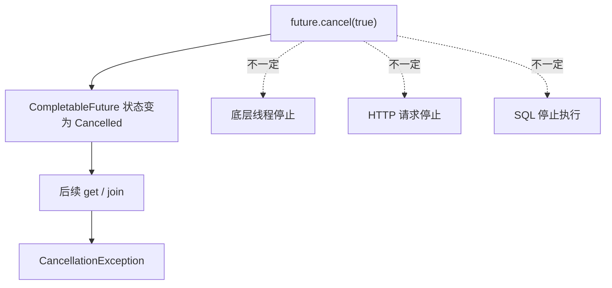

也就是说：

> **Future 被取消，不代表任务本身一定停止。**

更不代表：

> **任务里面调用的远程资源已经停止。**

例如：

```java
CompletableFuture<Void> future =
        CompletableFuture.runAsync(() -> {
            while (true) {
                doSomething();
            }
        });

future.cancel(true);
```

即使：

```java
future.isCancelled() == true
```

里面的循环仍然可能继续执行。

所以我们先得到第一个结论：

> **取消 Future ≠ 取消任务 ≠ 取消底层资源。**

---

# 2. CompletableFuture 本质上只是任务组合工具

我们经常把：

```java
CompletableFuture
```

理解为一个完整的异步任务框架。

但更准确地说：

> `CompletableFuture` 更擅长解决的是异步任务的组合问题，而不是底层资源生命周期问题。

例如：

```java
CompletableFuture<User> userFuture = queryUser();

CompletableFuture<List<Post>> postFuture = queryPosts();

return userFuture.thenCombine(
        postFuture,
        HomeVO::new
);
```

它非常擅长：

```text
任务 A
任务 B
任务 C
   ↓
组合
   ↓
转换
   ↓
聚合
```

但是它不知道：

```text
任务 A 里面是 HTTP
任务 B 里面是 Redis
任务 C 里面是 MySQL
```

因此它也没有能力自动完成：

```text
future.cancel()
        ↓
HTTP Call.cancel()

future.cancel()
        ↓
JDBC Statement.cancel()

future.cancel()
        ↓
Dubbo RPC Cancel
```

这些事情。

---

# 3. 如果 CompletableFuture 里面是 HTTP 呢？

假设：

```java
CompletableFuture<String> future =
        CompletableFuture.supplyAsync(() -> {
            return httpClient.query();
        });
```

实际执行链路是：

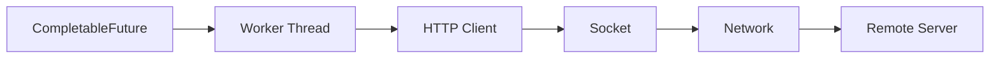

如果此时：

```java
future.cancel(true);
```

很可能只是：

```text
CompletableFuture:
“这个结果我不要了。”
```

但 HTTP 请求可能还在继续。

所以 HTTP Client 本身必须拥有：

- 请求超时
- 连接超时
- 读取超时
- 主动取消能力

---

# 4. HTTP 推荐：OkHttp

如果是同步 Java 微服务，我比较推荐 OkHttp。

例如：

```java
OkHttpClient client = new OkHttpClient.Builder()
        .connectTimeout(Duration.ofMillis(300))
        .readTimeout(Duration.ofSeconds(2))
        .writeTimeout(Duration.ofSeconds(2))
        .callTimeout(Duration.ofSeconds(3))
        .build();
```

这里最值得关注的是：

```java
callTimeout()
```

它约束的是整个 HTTP Call 的生命周期。

同时 OkHttp 有一个非常重要的对象：

```java
Call call = client.newCall(request);
```

它可以主动：

```java
call.cancel();
```

因此可以把 HTTP 调用和 Future 分开理解：

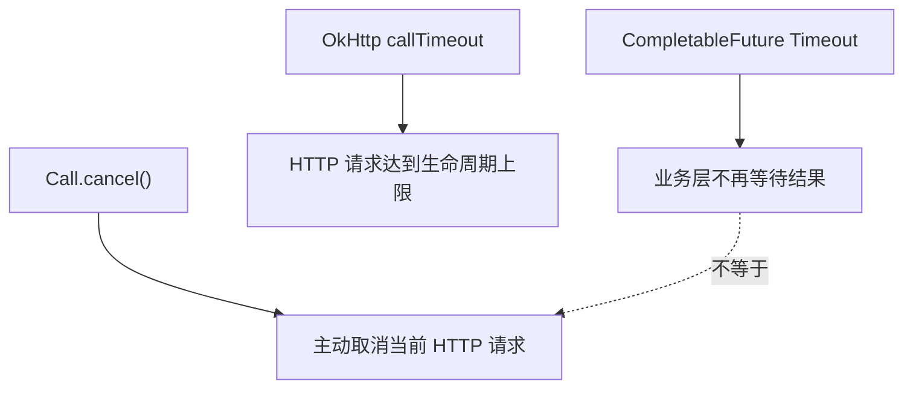

所以：

```text
CompletableFuture
负责：
“我要不要继续等待结果”

OkHttp
负责：
“这个网络请求还能不能继续”
```

这是两个不同的职责。

---

# 5. Dubbo timeout 也是同样的问题

例如：

```java
@DubboReference(timeout = 300)
private UserService userService;
```

然后：

```java
CompletableFuture<User> userFuture =
        CompletableFuture.supplyAsync(
                () -> userService.getUser(userId)
        );
```

如果外面：

```java
userFuture.cancel(true);
```

并不能简单理解为：

```text
Dubbo RPC 被真正取消
```

RPC 生命周期真正应该依赖：

```java
@DubboReference(timeout = 300)
```

因此建议分成：

```text
CompletableFuture timeout
        ↓
控制聚合等待

Dubbo timeout
        ↓
控制 RPC 等待
```

但是这里还有一个更深的问题。

假设：

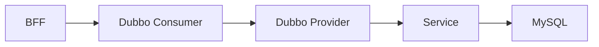

如果 BFF 已经超时：

```text
BFF:
“不等了。”
```

Provider 端可能仍然在：

```java
userMapper.selectById(userId);
```

甚至 MySQL 里的 SQL 仍然在执行。

所以：

> **Consumer timeout ≠ Provider 业务立即停止。**

---

# 6. MySQL 是最典型的例子

例如：

```java
CompletableFuture<User> future =
        CompletableFuture.supplyAsync(() ->
                jdbcTemplate.queryForObject(
                        sql,
                        User.class
                )
        );
```

虽然外面是：

```text
CompletableFuture
```

但内部其实还是：

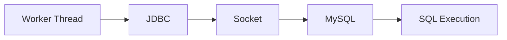

传统 JDBC 本质上是 Blocking IO。

所以：

```java
future.cancel(true);
```

不代表：

```text
MySQL 里的 SQL 消失了
```

数据库层应该自己设置：

```java
statement.setQueryTimeout(2);
```

或者在支持的场景调用：

```java
statement.cancel();
```

所以：

```text
CompletableFuture Cancel
```

和：

```text
Database Query Cancel
```

完全是两个层面的事情。

可以理解成：

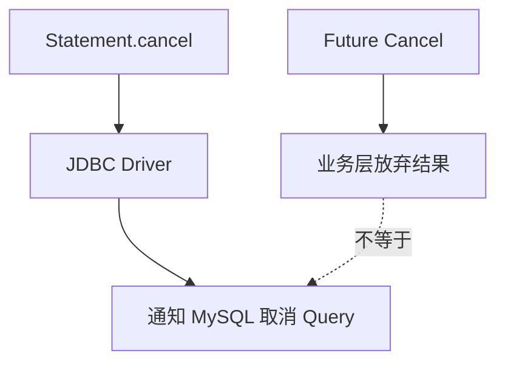

---

# 7. Redis 也是一样

例如：

```java
CompletableFuture<String> redisFuture =
        CompletableFuture.supplyAsync(() ->
                redisTemplate.opsForValue().get(key)
        );
```

Redis 调用链：

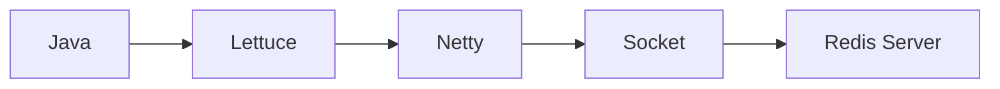

Future 被取消之后，并不意味着已经发送给 Redis 的命令自动消失。

所以 Redis Client 本身同样需要：

```text
Connect Timeout
Command Timeout
```

如果使用 Spring Boot，我更倾向：

```text
Spring Data Redis
        +
Lettuce
```

而不是试图：

```text
CompletableFuture.cancel()
```

去承担 Redis 的生命周期管理。

---

# 8. 那是不是把线程停掉就可以？

这是另一个非常容易产生的想法。

既然任务最终是在一个 Thread 里面执行：

```java
CompletableFuture.supplyAsync(...)
```

那是不是只需要：

```text
把 Thread 停掉
```

就够了？

答案依然是：

**不够。**

因为一次远程调用占用的资源远远不只有线程和 CPU。

例如 HTTP：

```text
TCP Connection
HTTP/2 Stream
Socket Buffer
Connection Pool
Kernel Buffer
Remote Server Thread
Remote Server CPU
```

数据库还可能占：

```text
DB Connection
数据库 CPU
Lock
Buffer Pool
Temporary Table
Disk IO
```

所以一个非常危险的情况是：

```text
上游已经不要结果了
        ↓
但是下游仍然继续执行
```

---

# 9. 不彻底取消，会造成什么问题？

假设：

```text
QPS = 5000
```

某个下游因为故障，每个调用需要：

```text
5 秒
```

才能真正结束。

理论上的在途请求数量：

```text
5000 × 5
=
25000
```

也就是说可能同时存在：

```text
25000 个下游请求
```

即使你的 BFF：

```text
500ms
```

就已经返回 Timeout。

这些请求仍可能继续占：

```text
Socket
Connection
DB Connection
RPC Thread
Memory
Remote CPU
Lock
```

最终产生：

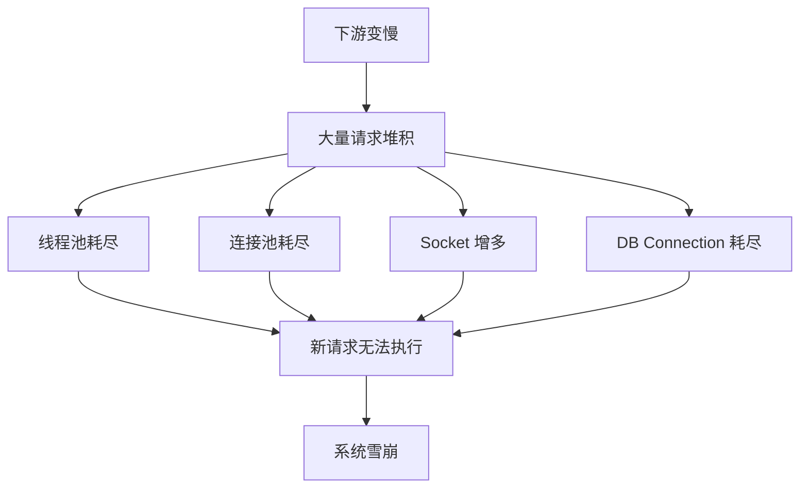

这也是为什么 Timeout 和 Cancellation 不只是：

> 用户体验问题。

它更是：

> **资源治理问题。**

---

# 10. Go 为什么在这个问题上更优雅？

然后我们来看 Go。

Go 里大量 API 都会接受：

```go
context.Context
```

例如：

```go
func QueryUser(
    ctx context.Context,
    userID int64,
) (*User, error) {
}
```

创建 Timeout：

```go
ctx, cancel := context.WithTimeout(
    context.Background(),
    500*time.Millisecond,
)

defer cancel()
```

500ms 后：

```go
ctx.Done()
```

会被关闭。

也可以主动调用：

```go
cancel()
```

所以：

```text
WithTimeout
    ↓
超时自动 cancel

WithCancel
    ↓
主动 cancel
```

最终都会变成：

```text
ctx.Done()
```

---

# 11. Go Context 可以一路往下传播

这是 Context 真正漂亮的地方。

例如：

```go
func Handler(
    w http.ResponseWriter,
    r *http.Request,
) {
    ctx, cancel :=
        context.WithTimeout(
            r.Context(),
            500*time.Millisecond,
        )

    defer cancel()

    user, err :=
        userService.Query(
            ctx,
            userID,
        )

    // ...
}
```

Service：

```go
func (s *UserService) Query(
    ctx context.Context,
    userID int64,
) (*User, error) {

    return s.repository.Query(
        ctx,
        userID,
    )
}
```

DB：

```go
db.QueryContext(
    ctx,
    sql,
    userID,
)
```

RPC：

```go
grpcClient.GetUser(
    ctx,
    request,
)
```

HTTP：

```go
request, err :=
    http.NewRequestWithContext(
        ctx,
        http.MethodGet,
        url,
        nil,
    )
```

于是：

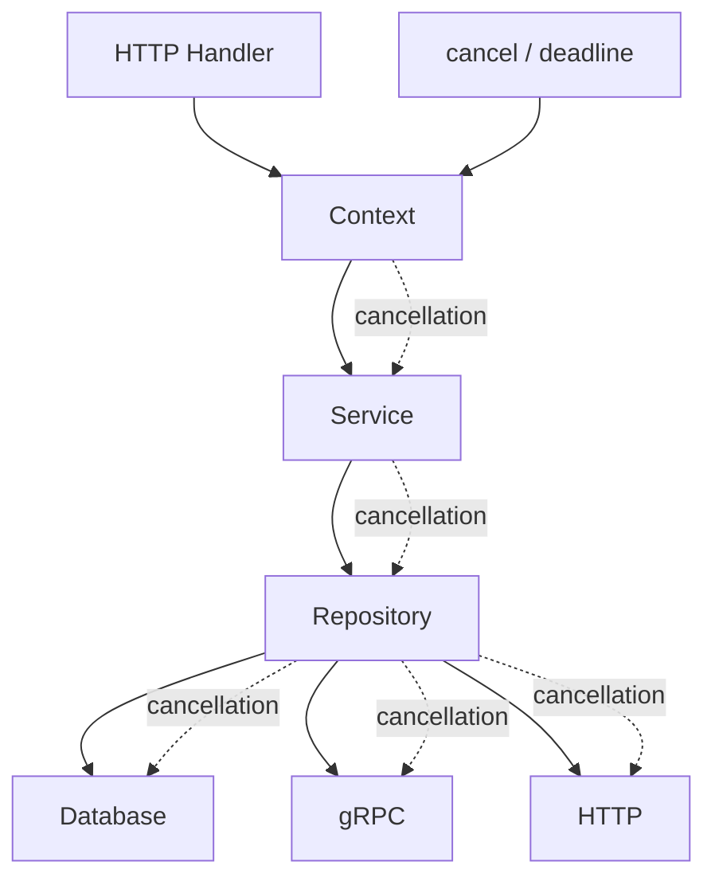

这就是：

```text
Cancellation Propagation
```

---

# 12. Context 需要一直 for + select，会不会 CPU 空转？

不一定。

例如：

```go
for {
    select {
    case <-ctx.Done():
        return

    default:
    }
}
```

这种确实容易形成：

```text
busy loop
```

CPU 不断执行：

```text
检查
↓
没取消
↓
继续
↓
检查
```

但是正确的阻塞式写法通常是：

```go
select {
case <-ctx.Done():
    return

case task := <-taskChannel:
    handle(task)
}
```

没有：

```go
default
```

时，goroutine 可以被 runtime 挂起等待。

所以：

```text
select + 没有 default
```

更接近：

```text
Event Wait
```

而不是：

```text
CPU Polling
```

---

# 13. 有 Context 就一定要手写 select 吗？

也不是。

如果下游 API 本身支持 Context：

```go
db.QueryContext(ctx, sql)

grpcClient.GetUser(ctx, request)

http.NewRequestWithContext(ctx, ...)
```

只需要：

```text
继续把 ctx 往下传
```

即可。

你真正需要自己检查：

```go
ctx.Done()
```

的一般是：

### 长时间 CPU 计算

```go
func calculate(
    ctx context.Context,
) error {

    for i := 0; i < 1_000_000_000; i++ {

        if i%10000 == 0 {
            select {
            case <-ctx.Done():
                return ctx.Err()

            default:
            }
        }

        calculateSomething(i)
    }

    return nil
}
```

### Channel / Worker

```go
func worker(
    ctx context.Context,
    tasks <-chan Task,
) {

    for {
        select {

        case <-ctx.Done():
            return

        case task := <-tasks:
            handle(task)
        }
    }
}
```

---

# 14. Go Context 仍然不是强制 Kill

这是理解 Context 最重要的一点。

它属于：

```text
Cooperative Cancellation
```

也就是：

> 协作式取消。

它不是：

```text
kill goroutine
```

不是：

```text
kill thread
```

更不是：

```text
kill -9
```

例如：

```go
func calculate(
    ctx context.Context,
) {

    for {
        heavyCalculate()
    }
}
```

即使：

```go
cancel()
```

这个方法也不会自己停。

因为：

```text
它根本没有检查 ctx
```

所以 Context 表达的是：

> “这个任务已经没有继续执行的必要了，请尽快停止。”

而不是：

> “操作系统，请立刻杀掉这个任务。”

---

# 15. Context Cancel 会不会关闭 TCP 长连接？

通常不会。

而且：

> 很多情况下也不应该。

例如 gRPC 基于 HTTP/2：

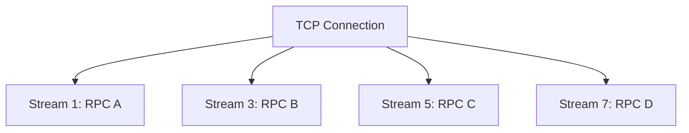

如果：

```text
RPC B
```

超时：

```go
cancel()
```

更合理的是取消：

```text
Stream 3
```

而不是：

```text
整个 TCP Connection
```

否则：

```text
RPC A
RPC C
RPC D
```

都会一起失败。

所以：

```text
Cancel RPC
    ≠
关闭 TCP Connection
    ≠
停止远端业务
```

一定要把这三个概念分开。

---

# 16. Java 和 Go 真正的区别

Go：

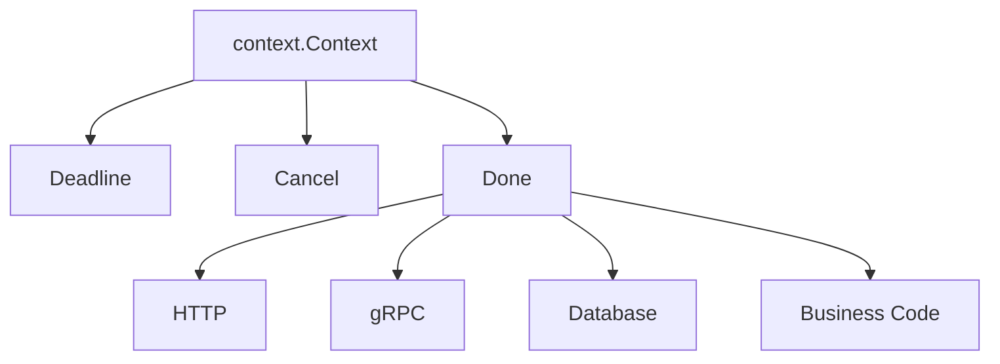

整个生态有一个相对统一的：

```text
Cancellation Signal
```

而传统 Java：

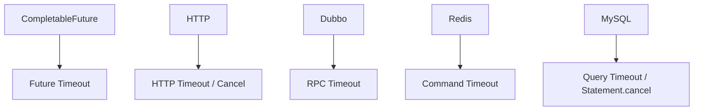

它们之间并没有天然统一。

因此 Java 更像：

```text
CompletableFuture
负责异步任务编排

各中间件 Client
负责自己的生命周期
```

---

# 17. CompletableFuture.allOf() 一个失败，需要取消其他任务吗？

答案：

**看业务语义。**

可以分成两种。

---

## Fail Fast

假设：

```text
A
B
C
```

三个任务必须全部成功。

任何一个失败：

```text
整个任务没有意义
```

例如：

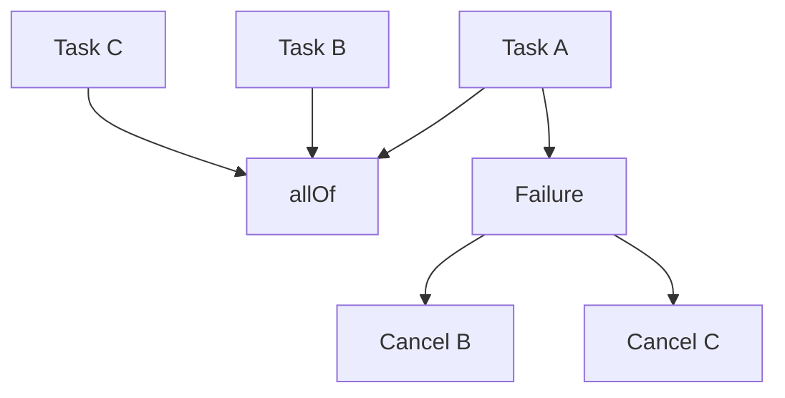

这种情况下：

```text
一个失败
→ 其他任务应该尽快停止
```

---

## Best Effort

BFF 首页通常不是这种模型。

例如：

```text
Banner
帖子
活动
推荐
```

Banner 挂了：

```text
帖子仍然有价值
活动仍然有价值
```

所以应该：

```json
{
  "banner": [],
  "posts": [
    {}
  ],
  "activities": [
    {}
  ]
}
```

而不是：

```text
Banner Failure
      ↓
Cancel Everything
```

所以：

> 是否取消 sibling task，首先是业务问题，然后才是技术问题。

---

# 18. 比 Timeout 更重要的是 Deadline

假设：

```text
整个请求最大 500ms
```

如果每层都配置：

```text
HTTP 500ms
Dubbo 500ms
Redis 500ms
MySQL 500ms
```

其实存在严重问题。

例如：

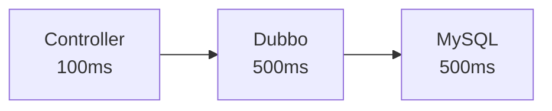

理论上整个调用可能远远超过：

```text
500ms
```

因为每一层：

```text
重新开始计时
```

真正应该传播的是：

```text
Deadline
```

例如：

```text
总预算
500ms

Controller
花 100ms

剩余
400ms

RPC
花 150ms

剩余
250ms

DB
最多还能使用
250ms
```

流程：

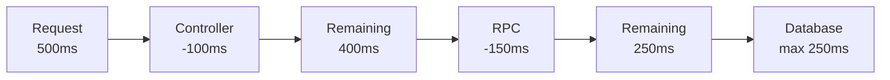

这是：

```text
Deadline Propagation
```

而不是：

```text
Timeout Propagation
```

两者差别非常大。

---

# 19. Java 可以实现自己的 DeadlineContext

Java 虽然没有 Go 那样统一的 `context.Context`，但我们完全可以在基础框架层设计一个非常薄的：

```java
public final class DeadlineContext {

    private final long deadlineNanos;

    private DeadlineContext(
            long deadlineNanos
    ) {
        this.deadlineNanos =
                deadlineNanos;
    }

    public static DeadlineContext timeout(
            Duration timeout
    ) {

        return new DeadlineContext(
                System.nanoTime()
                        + timeout.toNanos()
        );
    }

    public Duration remaining() {

        long remaining =
                deadlineNanos
                        - System.nanoTime();

        return Duration.ofNanos(
                Math.max(
                        remaining,
                        0
                )
        );
    }

    public boolean expired() {
        return remaining().isZero();
    }
}
```

请求开始：

```java
DeadlineContext context =
        DeadlineContext.timeout(
                Duration.ofMillis(500)
        );
```

然后：

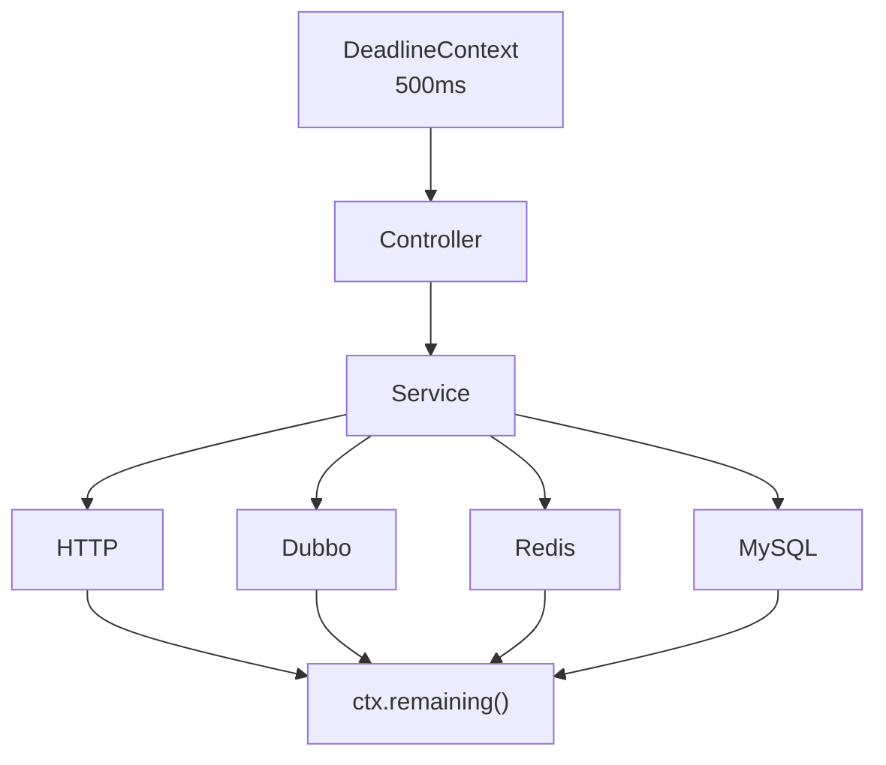

所有底层客户端：

```text
根据剩余时间
设置当前调用的 timeout
```

---

# 20. 但是 DeadlineContext 仍然不能直接取消底层资源

它只解决：

```text
统一 Deadline 语义
```

真正的资源释放仍然应该由不同 Client 完成。

例如：

```text
HTTP
↓
OkHttp Call.cancel()

Dubbo
↓
RPC timeout / cancellation

Redis
↓
Lettuce command timeout

MySQL
↓
Statement query timeout
Statement.cancel()
```

因此架构应该是：

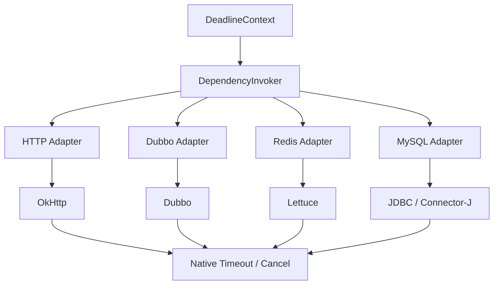

Context：

```text
负责统一语义
```

Client：

```text
负责真正资源生命周期
```

---

# 21. Java 有没有现成的开源方案？

比较接近的方案是：

```text
Resilience4j
```

它可以提供：

```text
TimeLimiter
CircuitBreaker
Bulkhead
Retry
RateLimiter
```

例如：

```java
TimeLimiterConfig config =
        TimeLimiterConfig.custom()
                .timeoutDuration(
                        Duration.ofMillis(500)
                )
                .cancelRunningFuture(true)
                .build();
```

但这里仍然必须注意：

```text
cancelRunningFuture = true
```

并不意味着：

```text
OkHttp Call.cancel()
JDBC Statement.cancel()
Dubbo Provider Stop
Redis Command Stop
```

全部自动发生。

所以 Resilience4j 更应该被定位成：

```text
Call Governance
```

而不是：

```text
IO Resource Cancellation Framework
```

---

# 22. 我更推荐的 Java 基础框架设计

如果让我设计公司级基础框架，我不会自己重新实现：

```text
HTTP Client
Redis Client
JDBC
Dubbo
CircuitBreaker
```

这些基础组件。

我只会做一层：

```text
Dependency Governance
```

最终架构：

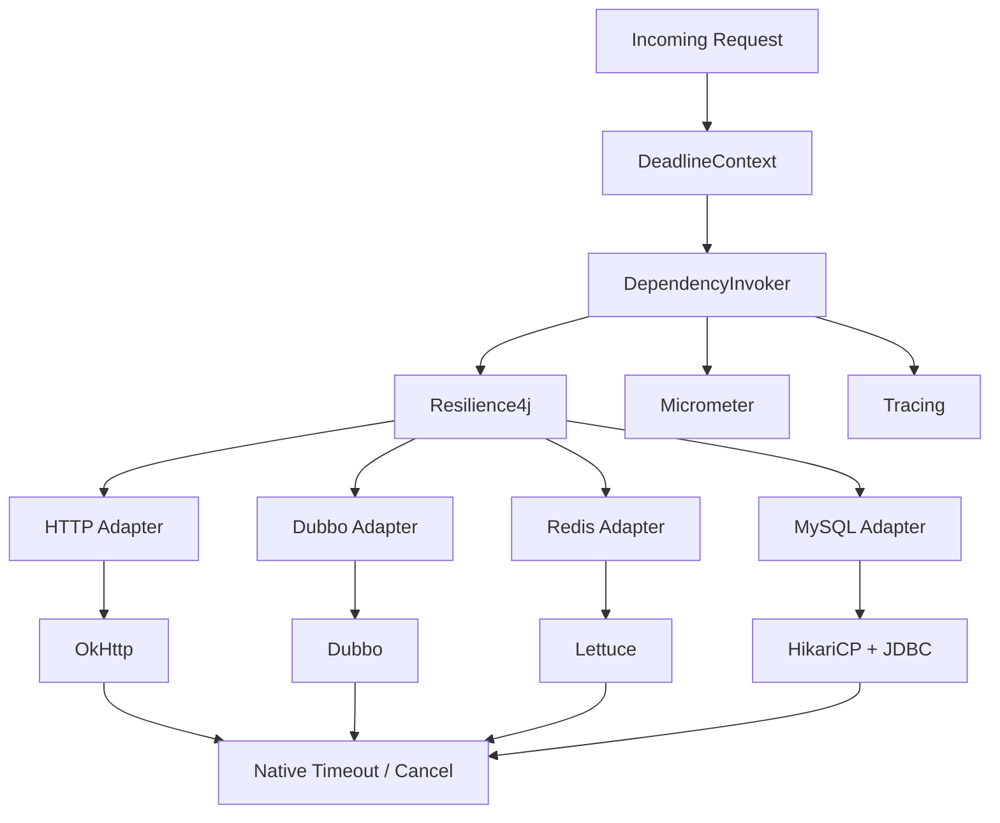

整体负责：

```text
Deadline
Cancellation
Timeout
Circuit Breaker
Retry
Bulkhead
Metrics
Tracing
Error Classification
```

---

# 23. 推荐的中间件组合

| 场景 | 推荐 |
|---|---|
| HTTP | OkHttp |
| RPC | Dubbo |
| Redis | Lettuce |
| MySQL Connection Pool | HikariCP |
| JDBC Driver | MySQL Connector/J |
| ORM / DAO | MyBatis / JdbcTemplate |
| Circuit Breaker | Resilience4j |
| Metrics | Micrometer |
| Trace | OpenTelemetry |

---

# 24. 基础框架应该重点统一什么？

我反而不建议：

```text
所有数据库调用必须使用 MyDatabaseClient

所有 HTTP 必须使用 MyHttpClient
```

这种侵入非常大的设计。

更值得统一的是：

```text
Deadline
Timeout
Metrics
Tracing
Retry
Circuit Breaker
Bulkhead
Error Classification
```

也就是说：

> **统一治理，而不是统一所有调用 API。**

---

# 25. Metrics 应该统一

例如：

```text
dependency.requests
dependency.duration
dependency.errors
dependency.timeout
dependency.cancelled
```

Tag：

```text
type=http|dubbo|redis|mysql

service=user-service

operation=queryUser

result=success|timeout|cancel|error
```

还可以细分：

```text
dependency.pool.wait
dependency.connect.duration
dependency.ttfb
dependency.read.duration
dependency.query.duration
```

最终 Grafana 可以看到：

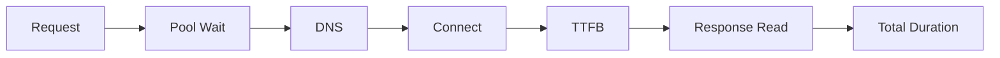

这样真正发生问题时，我们才知道：

```text
到底慢在哪里？
```

而不是只看到：

```text
CompletableFuture Timeout
```

---

# 26. 最后重新理解 Cancel

经过这一轮分析，我认为：

```text
Cancel
```

至少应该拆成五层。

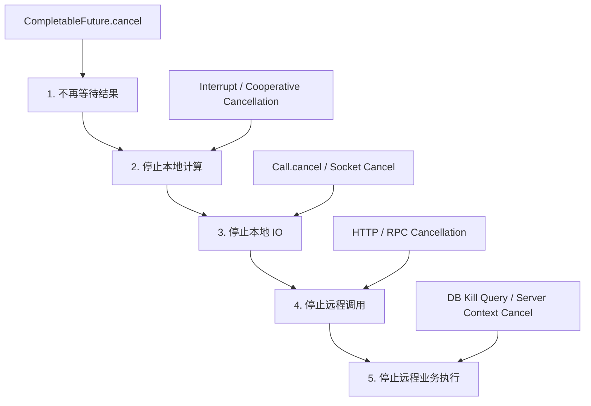

对应关系：

### 第一层：不再等待结果

```java
future.cancel(true);
```

或者：

```java
future.orTimeout(
        500,
        TimeUnit.MILLISECONDS
);
```

---

### 第二层：停止本地计算

```text
Thread Interrupt
Cooperative Cancellation
```

---

### 第三层：停止本地 IO

```java
call.cancel();
```

---

### 第四层：停止远程调用

```text
HTTP Request Cancellation

RPC Stream Cancellation
```

---

### 第五层：停止远端真正执行

例如：

```text
数据库停止 SQL

Provider 停止业务计算

下游继续传播 Deadline
```

这才是最难的一层。

---

# 27. Java 与 Go 的最终对比

## Go

```mermaid
flowchart TD
    A["context.Context"]

    A --> B["Deadline"]
    A --> C["Cancellation"]
    A --> D["Done"]

    D --> E["HTTP"]
    D --> F["RPC"]
    D --> G["Database"]
    D --> H["Business Code"]

    E --> I["Cooperative Cancellation"]
    F --> I
    G --> I
    H --> I
```

核心思想：

```text
一个 cancellation signal
贯穿调用链
```

---

## Java

```mermaid
flowchart TD
    A["Application Deadline"]

    A --> B["CompletableFuture"]

    A --> C["HTTP"]
    A --> D["Dubbo"]
    A --> E["Redis"]
    A --> F["MySQL"]

    C --> G["OkHttp Timeout / Cancel"]
    D --> H["Dubbo Timeout"]
    E --> I["Lettuce Timeout"]
    F --> J["JDBC Timeout / Cancel"]

    B --> K["Async Composition"]
```

核心思想：

```text
统一 Deadline

但是：

底层生命周期
由不同 Client 管理
```

---

# 28. 结语

这篇文章最开始只是一个很简单的问题：

```java
CompletableFuture.allOf(
        a,
        b,
        c
);
```

如果：

```text
其中一个 Future 超时
```

那么：

> 要不要取消另外两个？

但一路往下思考，就会发现真正的问题其实不是：

> `CompletableFuture` 怎么 cancel？

而是：

> **当一个请求已经失去业务价值以后，整个调用链上的无效工作应该如何尽快停止？**

这个调用链可能包含：

```text
Future
Thread
Socket
HTTP
RPC
Redis
MySQL
Remote Service
```

一个真正完善的 Cancel 体系，需要同时考虑：

```text
业务层
↓
这个结果是否还有价值

任务层
↓
是否继续等待

客户端层
↓
是否终止 IO

RPC 层
↓
是否取消远程调用

服务端
↓
是否响应 cancellation

数据库
↓
是否停止 Query

基础框架
↓
是否存在 Deadline

可观测性
↓
取消之后资源是否真的释放
```

所以：

> **优雅地 Cancel，从来都不只是调用一个 `future.cancel(true)`。**

它本质上是：

> **对一次分布式请求完整生命周期的治理。**

而如果我们真的要在 Java 基础框架中解决这个问题，我认为最合理的方向不是重新造一个 HTTP、Redis 或 RPC 框架。

而是构建一层很薄的：

```text
Deadline
+
Cancellation
+
Resilience
+
Observability
```

让 OkHttp、Dubbo、Lettuce、JDBC 这些成熟组件继续负责它们擅长的事情。

最终形成：

```mermaid
flowchart LR
    A["Request"]

    A --> B["Deadline"]

    B --> C["Governance"]

    C --> D["HTTP"]
    C --> E["RPC"]
    C --> F["Redis"]
    C --> G["MySQL"]

    D --> H["Native Cancel"]
    E --> H
    F --> H
    G --> H

    H --> I["Resource Released"]
```

我认为，这才是 Java 中真正值得讨论的：

> **如何优雅地 Cancel。**