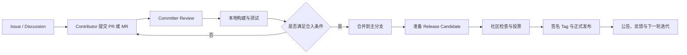

维护一个开源框架，不只是把代码合并到 `main`。真正困难的是建立一套让陌生人也能参与、让变更可以被验证、让版本能够被信任的协作机制。

这篇文章从三个视角展开：

- **Contributor**：如何提出问题、提交代码并响应 Review；
- **Committer**：如何审查变更、在本地验证 PR/MR，并对合入结果负责；
- **Owner / Maintainer / PMC**：如何治理社区、推动讨论、管理发布与长期演进。

GitHub 和 GitLab 是协作平台，Apache 则提供了一套成熟的社区治理方法。二者不能简单画等号，但可以组合成一条完整的开源工作流。



## 一、先分清角色：权限不等于治理权

“Contributor”“Committer”“Owner”经常被混在一起，但它们来自不同层次。

| 角色          | 核心职责                             | 通常具备的权限                     | 不应该默认拥有的权力         |
| ------------- | ------------------------------------ | ---------------------------------- | ---------------------------- |
| Contributor   | 提 Issue、文档、测试、代码或社区支持 | Fork、提交 PR/MR、参与讨论         | 直接写主分支、决定发布       |
| Committer     | 持续 Review、维护模块、合并合格变更  | 仓库写权限或合并权限               | 单方面决定路线、绕过社区规则 |
| Maintainer    | 维护工程质量和日常协作秩序           | 分支、标签、CI、Release 等维护权限 | 把个人偏好当成社区共识       |
| Owner / Admin | 管理组织、仓库和安全边界             | 成员、权限、密钥、仓库设置         | 因平台权限自动获得技术正确性 |
| Apache PMC    | 对项目治理、合规和正式发布负责       | 对 Release 等事项投绑定票          | 代表雇主控制项目             |

在 GitHub 组织仓库中，平台预置的是 `Read / Triage / Write / Maintain / Admin` 等仓库角色；Organization Owner 则拥有组织级管理权。所谓“Committer”更多是项目治理身份，通常映射为 `Write` 或 `Maintain`，但并不是 GitHub 的统一内置角色。参见 [GitHub 仓库角色说明](https://docs.github.com/en/organizations/managing-user-access-to-your-organizations-repositories/managing-repository-roles/repository-roles-for-an-organization)。

GitLab 使用 `Guest / Planner / Reporter / Developer / Maintainer / Owner` 等平台角色。默认情况下，受保护的主分支通常由 Maintainer 及以上角色控制合并，但最终仍以项目的保护分支和审批规则为准。参见 [GitLab Merge Request 文档](https://docs.gitlab.com/user/project/merge_requests/)。

Apache 项目中更准确的治理路径是：

```text
User → Contributor → Committer → PMC Member
```

Committer 的含义不是“写过很多代码”，而是已经用持续行动证明自己对项目负责。文档、用户支持、设计、社区活动同样可以构成贡献。PMC 则负责项目方向、社区健康、合规和正式发布；PMC Chair 是协调者与对外联络人，不是项目的独裁领导者。参见 [Apache PMC 说明](https://community.apache.org/pmc/) 和 [添加 Committer 的指导](https://community.apache.org/pmc/adding-committers.html)。

## 二、Contributor：一次高质量贡献如何完成

### 1. 动手之前先建立上下文

不要看到一处代码不顺眼就直接重构。先确认：

1. 仓库是否有 `CONTRIBUTING.md`、`CODE_OF_CONDUCT.md`、开发邮件列表和 Issue 模板；
2. 变更是否已有 Issue、Discussion、设计文档或正在进行的 PR/MR；
3. 是否需要签署 CLA，或者在提交中加入 DCO `Signed-off-by`；
4. 项目支持哪些运行时、操作系统和兼容版本；
5. 项目要求执行哪些格式化、单测、集成测试和许可证检查。

CLA、DCO、提交格式都应以目标项目规则为准，不要擅自替项目选择。

对于 Bug，先写清楚最小复现场景：

```text
环境：JDK 21 / Linux / framework 1.4.0
前置条件：启用异步执行器，队列容量为 1
操作步骤：连续提交 3 个任务并关闭执行器
实际结果：最后一个 Future 永远不结束
预期结果：任务被拒绝并以明确异常结束
最小仓库或测试：<link>
```

### 2. Fork、同步上游并创建单一目的分支

```bash
# origin 指向自己的 Fork
git clone https://github.com/<your-name>/<project>.git
cd <project>

# upstream 指向官方仓库
git remote add upstream https://github.com/<org>/<project>.git
git fetch upstream

# 每个 PR 只解决一个清晰问题
git switch -c fix/123-rejected-future upstream/main
```

编码时遵循三个原则：

- **最小范围**：不要在 Bug 修复里顺手重构无关代码；
- **测试先行**：至少留下一个能在修复前失败、修复后通过的回归测试；
- **解释原因**：注释和提交信息说明“为什么”，代码本身负责表达“怎么做”。

提交前检查实际改动：

```bash
git status --short
git diff --check
git diff upstream/main...HEAD

# 按项目要求执行；以下只是示例
./mvnw test
# 或
./gradlew test
```

然后提交并推送：

```bash
git add -p
git commit -m "fix: complete rejected futures"
git push -u origin fix/123-rejected-future
```

如果项目明确要求 DCO，再使用 `git commit -s`，不要把签署动作当成所有开源项目的通用规则。

### 3. PR/MR 描述应该让 Reviewer 少做侦探

一个合格的描述至少回答：

```markdown
## 问题

什么场景会失败？影响谁？

## 根因

错误发生在哪条调用链，为什么现有测试没有发现？

## 修改

改了什么，为什么选择这个方案？

## 验证

- [ ] 新增回归测试
- [ ] 原有测试通过
- [ ] 手工验证了关键路径

## 兼容性与风险

是否改变 API、配置、序列化格式、线程模型或依赖版本？

Closes #123
```

GitHub 和 GitLab 的 PR/MR 都是“围绕一个变更展开的可审计讨论”，不是代码上传入口。GitHub 官方也把标准流程概括为分支或 Fork、提交、发起 PR、Review、更新和合并。参见 [GitHub Pull Request 说明](https://docs.github.com/en/pull-requests/get-started/about-pull-requests)。

## 三、Committer：Review 的不是 Diff，而是变更后的系统

只看新增的十几行代码，很容易错过真正的影响面。我的 Review 顺序通常是：

```text
Issue → PR/MR 描述 → Diff → 调用链 → 并发/异常边界 → 测试 → CI → 合入策略
```

### 1. 先判断范围，再判断实现

Review 开始时先回答：

- PR 是否解决了 Issue 描述的问题？
- 是否偷偷扩大了 API、依赖、配置或数据库范围？
- 是否改变了失败语义、线程模型、资源生命周期或兼容性？
- 是否存在更小、位于共享根因位置的修复？
- 文档、测试和实现是否描述了同一种行为？

### 2. 评论要能推动修复

好的 Review 评论包含四部分：

```text
问题：这里在 timeout 后仍可能写入已经复用的 buffer。
场景：请求 A 超时归还对象，随后请求 B 取得同一对象；A 的回调晚到。
影响：B 的响应可能混入 A 的数据，属于数据隔离问题。
建议：在归还前取消回调，并用 generation/token 拒绝过期写入；补一个晚到回调测试。
```

避免只有“这里不太好”“建议优化”或个人风格偏好。能够在当前 PR 内修复的问题给出明确方向；与目标无关的问题建独立 Issue，不要无限扩大当前变更。

GitHub Review 可以选择 `Comment`、`Approve` 或 `Request changes`；GitLab 也支持把多条评论组成一次 Review，并依据项目配置阻止带有 Change Request 的 MR 合并。参见 [GitHub Review 快速入门](https://docs.github.com/en/pull-requests/get-started/reviewing-pull-requests-quickstart) 与 [GitLab Merge Request Review](https://docs.gitlab.com/user/project/merge_requests/reviews/)。

### 3. 合并前的最低门禁

- PR/MR 的 HEAD SHA 与你实际审查、测试的 SHA 一致；
- 必需 CI、许可证、静态检查和测试全部通过；
- 必需 Reviewer 或 Code Owner 已批准；
- 所有阻塞讨论已解决；
- 没有未说明的破坏性变更；
- 合并方式符合项目历史策略：merge、squash 或 rebase；
- Release Note、迁移说明和兼容性标记已补齐。

`CODEOWNERS` 可以自动请求对应模块的 Reviewer，但它解决的是“找谁看”，不能替代真正的审查。参见 [GitHub CODEOWNERS 文档](https://docs.github.com/en/repositories/managing-your-repositorys-settings-and-features/customizing-your-repository/about-code-owners)。

## 四、如何在本地拉取某个 PR/MR 自测

复杂变更不能只相信 CI 的绿色图标。并发、网络、文件系统、性能、打包和跨平台问题往往需要本地复现。

开始前先保护自己的工作区：

```bash
git status --short
```

如果当前目录有未提交修改，不要强行切分支；使用新的 clone 或 `git worktree` 隔离验证环境。

### GitHub：拉取 PR

最简单的方法是 GitHub CLI：

```bash
gh pr checkout 123 --branch review/pr-123
```

GitHub 官方推荐 `gh pr checkout <PR>` 检出 PR。参见 [本地检出 Pull Request](https://docs.github.com/en/pull-requests/how-tos/review-pull-requests/checking-out-pull-requests-locally)。

不安装 GitHub CLI 也可以直接 Fetch PR ref：

```bash
git fetch upstream pull/123/head:review/pr-123
git switch review/pr-123
```

这里假设官方仓库的 remote 名称是 `upstream`；如果你的官方 remote 叫 `origin`，替换即可。

### GitLab：拉取 MR

使用 GitLab CLI：

```bash
glab mr checkout 123 --branch review/mr-123
```

参见 [`glab mr checkout` 文档](https://docs.gitlab.com/cli/mr/checkout/)。纯 Git 方式为：

```bash
git fetch origin merge-requests/123/head:review/mr-123
git switch review/mr-123
```

GitLab 为 MR 暴露 `refs/merge-requests/<iid>/head`，官方故障排查文档也给出了同类 Fetch 方法。参见 [GitLab 本地检出 MR](https://docs.gitlab.com/user/project/merge_requests/merge_request_troubleshooting/)。

### 本地到底测什么

检出只是开始。先记录你验证的提交：

```bash
git rev-parse HEAD
git log -1 --oneline
git diff upstream/main...HEAD
```

然后按风险分层验证：

1. **定向测试**：先跑能覆盖修改模块的最小测试集；
2. **完整测试**：再跑项目要求的全量构建与测试；
3. **问题复现**：按照 Issue 的原始步骤验证修复前后差异；
4. **边界测试**：超时、异常、取消、空输入、并发和资源关闭；
5. **兼容性**：项目承诺支持的 JDK、Node、数据库或操作系统版本；
6. **产物测试**：从实际构建出的包启动，而不是只运行 IDE 中的源码。

Review 结论要明确证据边界：

```text
Verified：在 commit abc1234 上，JDK 17/21 的模块测试通过，并复现了 Issue 场景。
Unknown：未验证 Windows、真实集群升级和十万并发下的性能。
```

“本机测试通过”不能写成“已经完成生产验证”。

## 五、Apache 风格的 Discussion 与决策流程

Apache Way 的关键不是邮件本身，而是**公开、异步、可归档、基于共识**。技术决策通常应发生在公开的开发者邮件列表；`private@` 只用于新增 Committer/PMC、个人事务、安全或法律等必须保密的内容。参见 [Apache PMC 职责](https://community.apache.org/pmc/responsibilities.html)。

### 什么时候发 `[DISCUSS]`

以下变化不适合直接用一个大 PR 代替讨论：

- 新模块、公共 API 或核心扩展点；
- 不兼容变更、依赖基线或运行时升级；
- 持久化格式、协议或线程模型变化；
- 项目路线、治理规则和发布节奏变化；
- 有多个合理方案，需要先形成共同认知。

一个可用的邮件标题：

```text
[DISCUSS] Introduce a unified cancellation contract for async tasks
```

正文建议包含：

```text
Background
- 当前行为与真实问题

Goals / Non-goals
- 本次解决什么，不解决什么

Options
- A：最小兼容方案
- B：新 API 方案
- C：维持现状

Trade-offs
- 兼容性、复杂度、性能、迁移成本

Proposal
- 推荐方案与分阶段落地方式

Open questions
- 希望社区重点反馈的问题
```

先讨论问题与约束，再讨论代码。不要先提交几千行实现，然后要求社区只能接受或拒绝。

### Lazy consensus 与正式投票

很多日常技术事项可以采用 lazy consensus：提出清晰方案，预留合理反馈时间；如果没有反对意见，就继续推进。遇到 `-1` 时，反对者应说明理由或替代方案，社区继续寻找共识。参见 [How the ASF works](https://www.apache.org/foundation/how-it-works/)。

正式事项使用 `[VOTE]`，典型结构为：

```text
[VOTE] Release Apache Example 1.4.0 RC1

The vote will remain open for at least 72 hours.

[ ] +1 Approve the release
[ ]  0 No opinion
[ ] -1 Do not release, because ...
```

结束后发送 `[RESULT][VOTE]`，列出绑定票、非绑定票和最终结论。非绑定票同样值得鼓励，因为它体现社区参与；但哪些票具有法律和治理效力，由项目章程与 ASF 规则决定。

## 六、Owner / PMC：如何把项目维护成系统

Owner 的工作不是承包所有 Issue，而是让项目在自己休假时仍能运转。

### 仓库最小治理基线

一个可持续的开源框架至少应清楚维护：

- `README.md`：定位、快速开始、支持范围；
- `CONTRIBUTING.md`：开发环境、测试命令、PR 流程；
- `CODE_OF_CONDUCT.md`：社区行为边界；
- `SECURITY.md`：私密报告漏洞的方式和支持版本；
- `LICENSE`、`NOTICE`：许可证与必要声明；
- Issue / PR 模板：固定复现、风险和验证信息；
- `CODEOWNERS` 或模块维护人清单；
- 受保护分支、必需 CI 和审批规则；
- Release、兼容性和弃用策略。

GitHub 的仓库角色建议遵循最小权限：Contributor 不需要先获得写权限；负责 Issue 分类的人可以使用 Triage；持续维护代码的人再逐步获得 Write/Maintain；Admin/Owner 只给需要管理敏感设置的人。

### 培养 Committer，而不是积攒 Followers

判断一个人是否适合成为 Committer，不应只统计 PR 数量，还要观察：

- 是否持续响应 Review 和用户问题；
- 是否理解项目边界，能拒绝不合适的复杂度；
- 是否愿意 Review 别人的代码；
- 是否尊重不同观点并帮助新人；
- 是否对测试、文档、兼容性和发布负责；
- 是否在没有商业利益驱动时仍关心项目健康。

权限应当是已经建立信任的结果，而不是吸引贡献的诱饵。

## 七、如何 Release、打 Tag 并发布版本

### 1. 先定义版本语义

如果项目采用语义化版本，可以按以下含义管理：

```text
MAJOR.MINOR.PATCH

MAJOR：不兼容变更
MINOR：向后兼容的新能力
PATCH：向后兼容的问题修复
```

是否采用 SemVer、CalVer 或项目自定义方案，应写进 Release Policy，避免每次发布临时争论。

### 2. 通用开源项目的 Release 清单

1. 明确发布范围、负责人和时间窗；
2. 确认主分支 CI 通过，阻塞 Issue 已处理；
3. 更新版本号、Changelog、升级与弃用说明；
4. 从确定的 commit 构建 Release Candidate；
5. 验证源码包、二进制包、依赖和许可证；
6. 在干净环境安装或启动实际发布产物；
7. 完成项目要求的 Review 或投票；
8. 创建不可变、可验证的正式 Tag；
9. 发布制品、容器镜像和 Release Notes；
10. 验证下载地址、校验和、文档与升级路径；
11. 宣布发布，并开始收集回归问题。

正式版本推荐使用 annotated tag；需要供应链可信度时使用 signed tag。Git 官方说明中，annotated tag 包含标签创建者、时间和说明，并明确更适合作为发布标记。参见 [`git tag` 文档](https://git-scm.com/docs/git-tag)。

```bash
# 确认将要发布的提交
git switch main
git pull --ff-only
git status --short
git log -1 --oneline

# 创建签名 Tag；如果项目没有签名体系，至少使用 -a 创建 annotated tag
git tag -s v1.4.0 -m "Release v1.4.0"
git tag -v v1.4.0

# 只推送这一个明确的 Tag
git push origin v1.4.0
```

不要习惯性使用 `git push --tags`，它可能把本地无关或临时标签一起发布。公开后的正式 Tag 不应被强制移动；如果版本有问题，撤下产物并发布修复版本或新的 Release Candidate，让历史保持可审计。

GitHub Release 以 Git Tag 为基础，可以附带 Release Notes 和二进制文件。参见 [GitHub Releases 说明](https://docs.github.com/en/repositories/releasing-projects-on-github/about-releases)。GitLab 也可以由 Tag Pipeline 自动创建 Release 和发布制品。无论使用哪个平台，Tag、源码、二进制制品、容器镜像和 Release Notes 都应能追溯到同一个 commit。

### 3. Apache Release 的额外要求

Apache 官方 Release 不是某个 Maintainer 点击“Publish”就成立。它必须是：

- 合规的源代码与发布材料；
- 由 Release Manager 准备；
- 由真实个人签名；
- 经过 PMC 的绑定投票批准；
- 发布到 ASF 的正式分发基础设施。

Release Candidate 可以反复创建和检查，但未经投票批准不能作为 Apache 正式版本对外发布。正式 Release 投票通常至少开放 72 小时；通过需要至少 3 个绑定 `+1`，并且绑定赞成票多于绑定反对票。参见 [ASF Release Policy](https://www.apache.org/legal/release-policy.html) 和 [Release Creation Process](https://infra.apache.org/release-publishing.html)。

一个简化流程是：

```text
社区同意发布
  → 指定 Release Manager
  → 固定 RC commit
  → 构建并签名源码/制品
  → 上传 dev 分发区
  → dev 邮件列表发起至少 72 小时的 [VOTE]
  → PMC 检查源码、签名、许可证、构建与功能
  → 发送 [RESULT][VOTE]
  → 通过后提升到 release 分发区
  → 发布正式 Tag、仓库制品、文档和公告
```

孵化项目还需要遵循 Incubator 和 IPMC 的额外审批流程；具体命令、Maven/Nexus 操作、Tag 命名及是否使用 RC 标签，以目标项目自己的 Release Guide 为准。

## 八、最容易踩的坑

### 把平台 Owner 当成技术领袖

Admin 权限只能证明“能操作”，不能证明“决策正确”。重大方向仍应公开讨论并留下依据。

### Contributor 一提交 PR 就要求立即合并

开源维护者通常是兼职志愿者。提供复现、测试、范围说明并耐心响应，比反复 `ping` 更有效。

### Reviewer 只看 CI

CI 只能覆盖被写进流水线的假设。Reviewer 仍需检查调用链、失败语义、兼容性和测试盲区。

### 本地测了 PR，却没有记录 SHA

作者随后 Push 新提交后，你的“测试通过”可能已经失效。Review 和测试结论必须关联确切 commit。

### Tag 与制品不是同一份源码

如果二进制包不是从被审查、被投票的源码构建，发布链路就不可追溯。发布制品应由固定 commit 或 Tag 可重复构建。

### 先发布，再补投票

在 Apache 项目中，投票是正式发布的前置门禁，不是发布后的通知流程。

## 结语

一个成熟的开源框架，最终依赖的不是某位 Owner 的英雄主义，而是可重复的协作闭环：

```text
公开问题 → 小步提交 → 可验证 Review → 社区共识 → 可追溯发布 → 持续培养维护者
```

Contributor 对贡献质量负责，Committer 对合入质量负责，Owner 或 PMC 对制度、社区和正式发布负责。当权限、责任和证据边界都足够清楚时，项目才能从“某个人公开的代码仓库”成长为“由社区共同维护的软件”。
